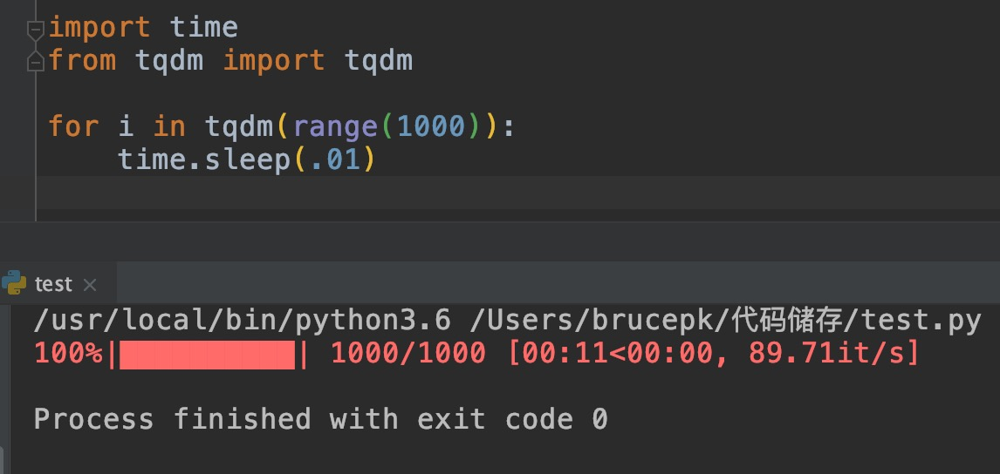

## Python基础
> 100道基础Python题目

# Python100-来自Python基础教程（第3版）和流畅的Python的例题

## 目录

[TOC]

把Python知识点整理成100道习题，知识点来自两本书：Python基础教程（第3版）和流畅的Python，以后会定期加入更多的习题，大家帮忙点个赞哈，点赞越多，更新越快～

- 怎么计算2的3次方
- 怎么找出序列中的最大最小值？
- 怎么将字符列表转为字符串
- 怎么快速打印出包含所有 ASCII 字母（大写和小写）的字符串
- 怎么让字符串居中
- 怎么在字符串中找到子串
- 怎么让字符的首字母大写，其他字母小写
- 怎么清空列表内容
- 怎么计算指定的元素在列表中出现了多少次？
- 怎么在列表末尾加入其它元素
- extend 和列表相加的区别？
- 怎么查找列表中某个元素第一次出现的索引，从 0 开始
- 怎么将一个对象插入到列表中
- 怎么删除列表中元素
- 怎么删除列表中指定元素
- 怎么让列表按相反顺序排列？
- 怎么表示只包含一个元素的元组
- 怎么批量替换字符串中的元素
- 怎么把字符串按照空格进行拆分
- 怎么去除字符串首位的空格
- 怎么给字典中不存在的key指定默认值
- 怎么快速求 1 到 100 所有整数相加之和
- 怎么查出模块包含哪些属性？
- 怎么快速查看某个模块的帮助文档
- 怎么快速启动浏览器打开指定网站
- Python里占位符怎么表示？
- 怎么给函数编写文档？
- 怎么定义私有方法？
- 怎么判断一个类是否是另一个类的子类？
- 怎么从一个非空序列中随机选择一个元素？
- 怎么查出通过 from xx import xx导入的可以直接调用的方法？
- 花括号{} 是集合还是字典？
- 怎么求两个集合的并集？
- 求两个集合的交集
- 求两个集合中不重复的元素？
- 求两个集合的差集？
- 从一个序列中随机返回 n 个不同值的元素
- 怎么生成两个数之间的随机实数
- 怎么在等差数列中随机选择一个数
- 怎么在文件里写入字符？
- 怎么读取文件内容？
- 怎么把程序打包成 exe 文件
- 怎么把程序打包成 Mac 系统可运行的 .app 文件
- 怎么获取路径下所有目录名称？
- Python 环境下怎么执行操作系统命令？
- 怎么将当前时间转为字符串？
- 怎么将秒数转为时间数组
- 将时间元组转换为从新纪元后的秒数
- 怎么将字符串转为时间元组
- 怎么随机打乱列表的顺序
- 怎么用for循环实现把字符串变成Unicode码位的列表
- 怎么用列表推导式实现把字符串变成Unicode码位的列表
- 打印出两个列表的笛卡尔积
- 可迭代对象拆包时，怎么赋值给占位符
- Python3 中，用什么方式接收不确定值或参数
- 用切片将对象倒序
- 怎么查看列表的 ID
- 可变序列用*=（就地乘法）后，会创建新的序列吗？
- 不可变序列用*=（就地乘法）后，会创建新的序列吗？
- 关于+=的一道谜题
- sort() 和 sorted() 区别
- 怎么通过 reverse 参数对序列进行降序排列
- numpy 怎么把一维数组变成二维数组
- 快速插入元素到列表头部
- 字典的创建方法
- 通过一次查询给字典里不存的键赋予新值
- 怎么统计字符串中元素出现的个数？
- 列表去重
- 求m中元素在n中出现的次数
- 新建一个Latin-1字符集合，该集合里的每个字符的Unicode名字里都有“SIGN”这个单词，用集合推导式完成。
- 查询系统默认编码方式
- 修改编码方式
- 用递归实现阶乘
- all([])的输出结果是多少？
- any([])的输出结果是多少？
- 怎么判断对象是否可被调用？
- 怎么列出对象的所有属性
- 怎么得到类的实例没有而函数有的属性列表
- 函数中，不想支持数量不定的定位参数，但是想支持仅限关键字参数，参数怎么定义
- 怎么给函数参数和返回值注解
- 不使用递归，怎么高效写出阶乘表达式
- Python什么时候执行装饰器？
- 判断下面语句执行是否会报错？
- 怎么强制把函数中局部变量变成全局变量
- 闭包中，怎么对数字、字符串、元组等不可变元素更新
- Python2 怎么解决访问外部变量报错的问题
- 测试代码运行的时间
- 怎么优化递归算法，减少执行时间
- 比较两个对象的值（对象中保存的数据）是否相等
- 比较两个对象的内存地址 id 是否相等
- 怎么格式化显示对象？
- 复制一个序列并去掉后 n 个元素
- Python中怎么定义私有属性。
- 怎么随机打乱一个列表里元素的顺序
- 怎么判断某个对象或函数是一个已知的类型
- 怎么打印出分数
- + 和 += 区别
- 怎么列出一个目录下所有的文件名和子文件名
- 怎么返回 1 到 10 的阶乘列表
- 怎么快速拼接字符串和序列形成新的列表
- 进度条显示

## 1怎么计算2的3次方

解法1:直接用运算符 ** 


```python
>>> 2**3
8
```

解法2:用函数 pow


```python
>>> pow(2,3)
8
```

## 2怎么找出序列中的最大最小值？

用内置函数 max 和 min


```python
>>> l = (123, 888, 666)
>>> max(l)
888
>>> min(l)
123
```

## 3怎么将字符列表转为字符串

用 join 方法，合并序列的元素


```python
>>> l = ['Python', 'Circle', 'is', 'ok']
>>> j = ' '.join(l)
>>> j
'Python Circle is ok'
```

## 4怎么快速打印出包含所有 ASCII 字母（大写和小写）的字符串

用 string 模块的方法

```python
>>> import string
>>> string.ascii_letters
'abcdefghijklmnopqrstuvwxyzABCDEFGHIJKLMNOPQRSTUVWXYZ'
```

## 5怎么让字符串居中

用字符串中的 center 方法，他会在两边自动填充字符（默认为空格），让字符串居中

```python
>>> k = '更多精彩，请关注公众号「Python知识圈」'
>>> k.center(50)
'              更多精彩，请关注公众号「Python知识圈」              '
>>> k.center(50, '*')
'**************更多精彩，请关注公众号「Python知识圈」**************'
```

## 6怎么在字符串中找到子串

用 find 方法，如果找到，就返回子串的第一个字符的索引，否则返回 -1

```python
>>> ss = 'I Love Python'
>>> ss.find('I')
0
>>> ss.find('Python')
7
```

## 7怎么让字符的首字母大写，其他字母小写

解法1:用 title 方法。

```python
>>> ss = 'i love python'
>>> ss.title()
'I Love Python'
```

解法2:用 string 模块里的 capwords 方法。


```python
>>> import string
>>> ss = 'i love python'
>>> string.capwords(ss)
'I Love Python'
```

## 8怎么清空列表内容

解法1:用 clear 方法

```python
>>> l = [1, 2, 3]
>>> l.clear()
>>> l
[]
```

解法2:用切片赋值的方法

```python
>>> k = [1, 2, 3]
>>> k[:] = []
>>> k
[]
```

## 9怎么计算指定的元素在列表中出现了多少次？

用 count 方法

```python
>>> l = ['i', 'am', 'ok', 'ok']
>>> l.count('ok')
2
```

## 10怎么在列表末尾加入其它元素

用 extend 方法

```python
>>> l = [1, 2, 3]
>>> j = [4, 5, 6]
>>> l.extend(j)
>>> l
[1, 2, 3, 4, 5, 6]
```

## 11extend 和列表相加的区别？

两者看起来效果一致

```python
>>> l = [1, 2, 3]
>>> j = [4, 5, 6]
>>> l + j
[1, 2, 3, 4, 5, 6]
```

extend 是直接在 l 列表里加入元素，相加会生成一个新元素，并不会对 l 做修改。

## 12怎么查找列表中某个元素第一次出现的索引，从 0 开始

用 index 方法

```python
>>> l = ['are', 'you', 'ok']
>>> l.index('you')
1
```

## 13怎么将一个对象插入到列表中

解法1：用 insert 方法


```python
>>> num = [1, 2, 4, 5]
>>> num.insert(2, 'three')
>>> num
[1, 2, 'three', 4, 5]
```

解法2：用切片的方式插入

```python
>>> num = [1, 2, 4, 5]
>>> num[2:2] = ['three']
>>> num
[1, 2, 'three', 4, 5]
```

## 14怎么删除列表中元素

pop 方法可以删除指定元素，不指定位置的话默认删除最后一个元素

```python
>>> num = [1, 2, 4, 5]
>>> num.pop()
5
>>> num
[1, 2, 4]
>>> num.pop(1)
2
>>> num
[1, 4]
```

## 15怎么删除列表中指定元素

用 remove 方法

```python
>>> num
[1, 4]
>>> num = [1, 2, 4, 5, 4]
>>> num.remove(4)
>>> num
[1, 2, 5, 4]
```

remove 方法只会删除第一次出现的元素

## 16怎么让列表按相反顺序排列？

解法1：用 reverse 方法

```python
>>> num = [1, 22, 45, 99, 49]
>>> num.reverse()
>>> num
[49, 99, 45, 22, 1]
```

解法2：用切片的方式

```python
>>> num = [1, 22, 45, 99, 49]
>>> num[::-1]
[49, 99, 45, 22, 1]
```

## 17怎么表示只包含一个元素的元组

1个元素的元组，必须在唯一的元素后加上逗号，否则不是元组

```python
>>> t= (1)
>>> type(t)
<class 'int'>
>>> t= (1,)
>>> type(t)
<class 'tuple'>
```

## 18怎么批量替换字符串中的元素

用 replace 方法

```python
>>> 'i love Python'.replace('o', 'ee')
'i leeve Pytheen'
```

## 19怎么把字符串按照空格进行拆分

用 split 方法，括号为空的情况下默认以空格拆分


```python
>>> 'i love Python'.split()
['i', 'love', 'Python']
```

## 20怎么去除字符串首位的空格

用 strip 方法

```python
>>> '   i love    Python  '.strip()
'i love    Python'
```

## 21怎么给字典中不存在的key指定默认值


```python
>>> d = {'age': 42, 'name': 'g'}
>>> d.get('aa', 'N/A')
'N/A'
```

## 22怎么快速求 1 到 100 所有整数相加之和

```python
>>> sum(range(1, 101))
5050
```

## 23怎么查出模块包含哪些属性？

用 dir 方法

```python
>>> dir(requests)
['ConnectTimeout', 'ConnectionError', 'DependencyWarning', 'FileModeWarning', 'HTTPError', 'NullHandler', 'PreparedRequest', 'ReadTimeout', 'Request', 'RequestException', 'RequestsDependencyWarning', 'Response', 'Session', 'Timeout', 'TooManyRedirects', 'URLRequired', '__author__', '__author_email__', '__build__', '__builtins__', '__cached__', '__cake__', '__copyright__', '__description__', '__doc__', '__file__', '__license__', '__loader__', '__name__', '__package__', '__path__', '__spec__', '__title__', '__url__', '__version__', '_check_cryptography', '_internal_utils', 'adapters', 'api', 'auth', 'certs', 'chardet', 'check_compatibility', 'codes', 'compat', 'cookies', 'delete', 'exceptions', 'get', 'head', 'hooks', 'logging', 'models', 'options', 'packages', 'patch', 'post', 'put', 'request', 'session', 'sessions', 'status_codes', 'structures', 'urllib3', 'utils', 'warnings']
```

## 24怎么快速查看某个模块的帮助文档


```python
>>> range.__doc__
'range(stop) -> range object
range(start, stop[, step]) -> range object

Return an object that produces a sequence of integers from start (inclusive)
to stop (exclusive) by step.  range(i, j) produces i, i+1, i+2, ..., j-1.
start defaults to 0, and stop is omitted!  range(4) produces 0, 1, 2, 3.
These are exactly the valid indices for a list of 4 elements.
When step is given, it specifies the increment (or decrement).

Process finished with exit code 0
'
```

## 25怎么快速启动浏览器打开指定网站

使用 webbrowser 库

```python
import webbrowser
webbrowser.open('http://www.python.org')

```

## 26Python里占位符怎么表示？

用 pass 占位，当你还没想好代码块的逻辑时，你需要运行代码调试其他功能，需要加占位符，不然会报错


```python
if name == '小明':
    print('听我的')
elif name == '小花':
    pass
```

## 27怎么给函数编写文档？

在 def 语句后面把注释文档放在引号（单引、双引、三引都可以）里面就行，这个文档可以通过 function.__doc__访问。

```python
>>> def square(x):
    """返回平方值"""
    return x*x

>>> square.__doc__
'返回平方值'
```

## 28怎么定义私有方法？

在方式名称前加两个下斜杠 __


```python
>>> class Person:
    def __name(self):
        print('私有方法')
```

用 from module import * 导入时不会导入私有方法。

## 29怎么判断一个类是否是另一个类的子类？

用 issubclass 方法，2 个参数，如果第一个参数是第二个参数的子类，返回 True，否则返回 False

```python
>>> class A:
    pass

>>> class B(A):
    pass

>>> issubclass(B, A)
True
```

## 30怎么从一个非空序列中随机选择一个元素？

用 random 中的 choice 方法

```python
>>> import random
>>> random.choice([1, 'two', 3, '肆'])
3
```

## 31怎么查出通过 from xx import xx导入的可以直接调用的方法？

用 __all__ 方法，这个方法查出的是模块下不带_的所有方法，可以直接调用。

```python
>>> import random
>>> random.__all__
['Random', 'seed', 'random', 'uniform', 'randint', 'choice', 'sample', 'randrange', 'shuffle', 'normalvariate', 'lognormvariate', 'expovariate', 'vonmisesvariate', 'gammavariate', 'triangular', 'gauss', 'betavariate', 'paretovariate', 'weibullvariate', 'getstate', 'setstate', 'getrandbits', 'choices', 'SystemRandom']

```

## 32花括号{} 是集合还是字典？

字典


```python
>>> type({})
<class 'dict'>
```

## 33怎么求两个集合的并集？

解法1:用 union 方法


```python
>>> a = {6, 7, 8}
>>> b = {7, 8, 9}
>>> a.union(b)
{6, 7, 8, 9}
```

解法2:使用按位或运算符 ｜ 

```python
>>> a = {6, 7, 8}
>>> b = {7, 8, 9}
>>> a | b
{6, 7, 8, 9}
```

## 34求两个集合的交集

解法1:


```python
>>> a = {6, 7, 8}
>>> b = {7, 8, 9}
>>> a&b
{8, 7}
```

解法2:用 intersection 方法


```python
>>> a = {6, 7, 8}
>>> b = {7, 8, 9}
>>> a.intersection(b)
{8, 7}
```

## 35求两个集合中不重复的元素？

差集指的是两个集合交集外的部分

解法1: 使用运算符 ^


```python
>>> a = {6, 7, 8}
>>> b = {7, 8, 9}
>>> a ^ b
{9, 6}
```

解法2:使用 symmetric_difference 方法


```python
>>> a = {6, 7, 8}
>>> b = {7, 8, 9}
>>> a.symmetric_difference(b)
{9, 6}
```

## 36求两个集合的差集？

解法1:用运算符 -


```python
>>> a = {6, 7, 8}
>>> b = {7, 8, 9}
>>> a-b
{6}
```

解法2:用 difference 方法

```python
>>> a = {6, 7, 8}
>>> b = {7, 8, 9}
>>> a.difference(b)
{6}
```

## 37从一个序列中随机返回 n 个不同值的元素

用 random 中的 sample 方法

```python
>>> import random
>>> t = (2020, 7, 3, 21, 48, 56, 4, 21, 0)
>>> random.sample(t, 2)
[56, 0]
```

## 38怎么生成两个数之间的随机实数

用 random 中的 uniform 方法


```python
>>> random.uniform(10, 20)
11.717127223103947
```

## 39怎么在等差数列中随机选择一个数

用 random 中的 randrange 方法

```python
>>> random.randrange(0, 100, 10)
70
```

## 40怎么在文件里写入字符？

用 open 函数，模式用 w


```python
>>> with open('bruce.txt', 'w') as f:
    f.write('hello world')

    
11
```

## 41怎么读取文件内容？

用 open 函数，模式用 r（默认情况下是r）

```python
>>> with open('bruce.txt', 'r') as f:
    f.read()

    
'hello world'
```

## 42怎么把程序打包成 exe 文件

用 Setuptools 里的 py2exe 库

## 43怎么把程序打包成 Mac 系统可运行的 .app 文件

- 安装py2app

```python
pip3 install py2app
```

- cd 到Demo.py文件所在的目录

- py2applet --make-setup Demo.py
    完成显示生成setup.py

## 44怎么获取路径下所有目录名称？

用 sys 下的 path 方法，返回的是目录名称的字符串列表

```python
>>> sys.path
['', '/Users/brucepk/Documents', '/usr/local/Cellar/python/3.7.3/Frameworks/Python.framework/Versions/3.7/lib/python37.zip', '/usr/local/Cellar/python/3.7.3/Frameworks/Python.framework/Versions/3.7/lib/python3.7', '/usr/local/Cellar/python/3.7.3/Frameworks/Python.framework/Versions/3.7/lib/python3.7/lib-dynload', '/usr/local/lib/python3.7/site-packages']
```

## 45Python 环境下怎么执行操作系统命令？

用 os 模块下的 system 方法

```python
>>> os.system('cd /Users/brucepk/Desktop && mkdir aaa.txt')
256
```

## 46怎么将当前时间转为字符串？

用 time 模块里的 asctime 方法


```python
>>> import time
>>> time.asctime()
'Sat Jul  4 17:36:00 2020'
```

## 47怎么将秒数转为时间数组

用 time 模块里的 localtime 方法


```python
>>> import time
>>> time.localtime(1888888888)
time.struct_time(tm_year=2029, tm_mon=11, tm_mday=9, tm_hour=11, tm_min=21, tm_sec=28, tm_wday=4, tm_yday=313, tm_isdst=0)
```

## 48将时间元组转换为从新纪元后的秒数

用 time 模块里的 mktime 方法

```python
>>> time.mktime((2020, 7, 3, 21, 48, 56, 4, 21, 0))
1593784136.0
```

## 49怎么将字符串转为时间元组

用 time 模块里的 strptime 方法

```python
>>> import time
>>> time.strptime('Sun Jul  5 08:29:51 2020')
time.struct_time(tm_year=2020, tm_mon=7, tm_mday=5, tm_hour=8, tm_min=29, tm_sec=51, tm_wday=6, tm_yday=187, tm_isdst=-1)
```

## 50怎么随机打乱列表的顺序

用 random 模块里的 shuffle 方法

```python
>>> import random
>>> t = list(range(20))
>>> t
[0, 1, 2, 3, 4, 5, 6, 7, 8, 9, 10, 11, 12, 13, 14, 15, 16, 17, 18, 19]
>>> random.shuffle(t)
>>> t
[16, 3, 13, 7, 6, 12, 17, 4, 15, 2, 5, 8, 18, 10, 9, 19, 14, 0, 1, 11]
```

## 51怎么用for循环实现把字符串变成Unicode码位的列表


```python
>>> st = '!@#$%^&*'
>>> codes = []
>>> for s in st:
    codes.append(ord(s))

>>> codes
[33, 64, 35, 36, 37, 94, 38, 42]
```

## 52怎么用列表推导式实现把字符串变成Unicode码位的列表


```python
>>> st = '!@#$%^&*'
>>> codes = [ord(s) for s in st]
>>> codes
[33, 64, 35, 36, 37, 94, 38, 42]
```

很明显，用列表推导式实现比 for 循环加 append 更高效简洁，可读性更好。

## 53打印出两个列表的笛卡尔积

解法1:使用生成器表达式产生笛卡尔积，可以帮忙省掉运行 for 循环的开销。

```python
>>> colors = ['blacks', 'white']
>>> sizes = ['S', 'M', 'L']
>>> for tshirt in ('%s %s'%(c, s) for c in colors for s in sizes):
    print(tshirt)

blacks S
blacks M
blacks L
white S
white M
white L
```

解法2:使用 itertools 里的 product 生成器函数。


```
>>> import itertools
>>> list(itertools.product(['blacks', 'white'], ['S', 'M', 'L']))
[('blacks', 'S'), ('blacks', 'M'), ('blacks', 'L'), ('white', 'S'), ('white', 'M'), ('white', 'L')]
```

## 54可迭代对象拆包时，怎么赋值给占位符

我们经常用 for 循环提取元组里的元素，对于我们不想接收的元素，我们可以用占位符 _ 接收。


```python
>>> player_infos = [('Kobe', '24'), ('James', '23'), ('Iverson', '3')]
>>> for player_names, _ in player_infos:
    print(player_names)

Kobe
James
Iverson
```

## 55Python3 中，用什么方式接收不确定值或参数

用 *args 的方式，*args 位置可以在任意位置。

```python
>>> a, b, *c = range(8)
>>> a, b, c
(0, 1, [2, 3, 4, 5, 6, 7])
```


```python
>>> a, *b, c, d = range(5)
>>> a,b,c,d
(0, [1, 2], 3, 4)
```


```python
>>> *a, b, c, d = range(5)
>>> a,b,c,d
([0, 1], 2, 3, 4)
```

## 56用切片将对象倒序


```python
>>> s = 'basketball'
>>> s[::-1]
'llabteksab'
```

## 57怎么查看列表的 ID


```python
>>> l = [1, 2, 3]
>>> id(l)
4507638664
```

## 58可变序列用*=（就地乘法）后，会创建新的序列吗？

不会，可变序列用*=（就地乘法）后，不会创建新的序列，新元素追加到老元素上，以列表为例，我们看下新老列表的id，相等的。


```python
>>> l = [1, 2, 3]
>>> id(l)
4507939272
>>> l *= 2
>>> l
[1, 2, 3, 1, 2, 3]
>>> id(l)
4507939272
```

## 59不可变序列用*=（就地乘法）后，会创建新的序列吗？

会，不可变序列用*=（就地乘法）后，会创建新的序列，以元组为例，我们看下新老元组的id，是不同的。


```python
>>> t = (1, 2, 3)
>>> id(t)
4507902240
>>> t *= 2
>>> t
(1, 2, 3, 1, 2, 3)
>>> id(t)
4507632648
```

所以，对不可变序列进行重复拼接操作的话，效率会很低，因为每次都有一个新对象，而解释器需要把原来对象中的元素先复制到新的对象里，然后再追加新的元素。

## 60关于+=的一道谜题


```python
t = (1, 2, [30, 40])
t[2] += [50, 60]
```

到底会发生下面4种情况中的哪一种？

a. t变成(1, 2, [30, 40, 50, 60])。

b.因为tuple不支持对它的元素赋值，所以会抛出TypeError异常。

c.以上两个都不是。

d. a和b都是对的。

答案是d，请看下运行结果。


```python
>>> t = (1, 2, [30, 40])
>>> t[2] += [50, 60]
Traceback (most recent call last):
  File "<pyshell#1>", line 1, in <module>
    t[2] += [50, 60]
TypeError: 'tuple' object does not support item assignment
>>> t
(1, 2, [30, 40, 50, 60])
```

## 61sort() 和 sorted() 区别


```python
l = [1, 9, 5, 8]
j = l.sort()
k = sorted(l)
```

通过 Python Tutor 工具我们可以看到，sort() 会就地在原序列上排序，sorted() 新建了一个新的序列。

list.sort方法会就地排序列表，也就是说不会把原列表复制一份。这也是这个方法的返回值是None的原因，提醒你本方法不会新建一个列表。在这种情况下返回None其实是Python的一个惯例：如果一个函数或者方法对对象进行的是就地改动，那它就应该返回None，好让调用者知道传入的参数发生了变动，而且并未产生新的对象。

## 62怎么通过 reverse 参数对序列进行降序排列

reverse 参数一般放在 sorted() 方法里面，reverse 默认值为 False，序列默认升序排列，降序排列的话需要将 reverse 值设置为 True。


```python
>>> l = [1, 9, 5, 8]
>>> j = sorted(l, reverse=True)
>>> j
[9, 8, 5, 1]
```

## 63numpy 怎么把一维数组变成二维数组


```python
>>> a = numpy.arange(12)
>>> a
array([ 0,  1,  2,  3,  4,  5,  6,  7,  8,  9, 10, 11])
>>> a.shape = 3, 4
>>> a
array([[ 0,  1,  2,  3],
       [ 4,  5,  6,  7],
       [ 8,  9, 10, 11]])
```

## 64快速插入元素到列表头部

可以通过切片指定位置插入，头部就是[0:0]

```python
>>> l = [1, 2, 3, 4, 5]
>>> l[0:0] = 'Python'
>>> l
['P', 'y', 't', 'h', 'o', 'n', 1, 2, 3, 4, 5]
```

还可以通过 insert() 方法插入，第一个参数是位置的坐标，从 0 开始。

```python
>>> l = [1, 2, 3, 4, 5]
>>> l.insert(0, 'first')
>>> l
['first', 1, 2, 3, 4, 5]
```

在第一个元素之前添加一个元素之类的操作是很耗时的，因为这些操作会牵扯到移动列表里的所有元素。有没有更高效的方法？用双向队列 deque 类。

deque 类可以指定这个队列的大小，如果这个队列满员了，还可以从反向端删除过期的元素，然后在尾端添加新的元素。


```python
>>> from collections import deque
>>> dp = deque(range(10), maxlen=15)
>>> dp
deque([0, 1, 2, 3, 4, 5, 6, 7, 8, 9], maxlen=15)
>>> dp.appendleft(-1)
>>> dp
deque([-1, 0, 1, 2, 3, 4, 5, 6, 7, 8, 9], maxlen=15)
```

## 65字典的创建方法

Python中，你知道怎么创建字典吗

```python
a = dict(one=1, two=2, three=3)
b = {'one': 1, 'two': 2, 'three': 3}
c = dict(zip(['one', 'two', 'three'], [1, 2, 3]))
d = dict([('two', 2), ('one', 1), ('three', 3)])
e = dict({'one': 1, 'two': 2, 'three': 3})


```

用字典推导（dictcomp）构建字典

```python
dial_code = [
    (86, 'China'),
    (91, 'India'),
    (1, 'US'),
    (55, 'Brazil'),
    (7, 'Russia'),
    (81, 'Japan')
]

coutry_code = {coutry:code for code, coutry in dial_code}
```

## 66通过一次查询给字典里不存的键赋予新值

用setdefault方法，只查询一次，效果更快

```python
coutry_code = {'China': 86, 'India': 91, 'US': 1, 'Brazil': 55, 'Russia': 7, 'Japan': 81}

coutry_code.setdefault('china', []).append(86)
```

如果用下面这种方法，需要查询三次


```python
if 'china' not in coutry_code:
    coutry_code['china'] = []
    coutry_code['china'].append(86)
print(coutry_code)
```

像k in my_dict.keys（　）这种操作在Python 3中是很快的，而且即便映射类型对象很庞大也没关系。这是因为dict.keys（　）的返回值是一个“视图”。视图就像一个集合，而且跟字典类似的是，在视图里查找一个元素的速度很快。在“Dictionary view objects”里可以找到关于这个细节的文档。Python 2的dict.keys（　）返回的是个列表，因此虽然上面的方法仍然是正确的，它在处理体积大的对象的时候效率不会太高，因为k in my_list操作需要扫描整个列表。

## 67怎么统计字符串中元素出现的个数？

用collections中的Counter方法统计，返回的结果是对应元素和个数形成的键值对。

```python
ct = collections.Counter('adcfadcfgbsdcv')
```

结果：


```python
Counter({'d': 3, 'c': 3, 'a': 2, 'f': 2, 'g': 1, 'b': 1, 's': 1, 'v': 1})
```


怎么统计出排名前n的元素？

用most_common方法，参数里填n，比如前两名的话


```python
ct.most_common(2)
```

结果

```python
[('d', 3), ('c', 3)]
```

## 68列表去重


```python
>>> l = ['A', 'B', 'A', 'B']
>>> list(set(l))
['A', 'B']

```

## 69求m中元素在n中出现的次数

基础解法：


```python
>>> m = {'A', 'B', 'C'}
>>> n = {'B', 'C', 'D'}
>>> found = 0
>>> for i in m:
    if i in n:
        found += 1
        
>>> found
2
```

高级解法：

```python
>>> m = {'A', 'B', 'C'}
>>> n = {'B', 'C', 'D'}
>>> len(m & n)
2
```

如果m和n不是集合的话，直接转换后再取交集

```python
>>> m = {'A', 'B', 'C'}
>>> n = {'B', 'C', 'D'}
>>> len(set(m) & srt(n))
2
```

高级解法的另一种写法：


```python
>>> m = {'A', 'B', 'C'}
>>> n = {'B', 'C', 'D'}
>>> len(set(m).intersection(n))
2
```

## 70新建一个Latin-1字符集合，该集合里的每个字符的Unicode名字里都有“SIGN”这个单词，用集合推导式完成。


```python
>>> from unicodedata import name
>>> {chr(i) for i in range(32, 256) if 'SIGN' in name(chr(i), '')}
{'§', '%', '#', '+', '¬', '£', '<', '$', '=', 'µ', '®', '÷', '©', '±', '°', '¤', '¥', '¶', '×', '>', '¢'}
```

## 71查询系统默认编码方式


```python
>>> fp = open('test.txt', 'w')
>>> fp.encoding
'cp936'
```

## 72修改编码方式


```python
>>> fp = open('test.txt', 'w', encoding='utf-8')
>>> fp.encoding
'utf-8'
```

## 73用递归实现阶乘


```python
def factorial(n):
    """:return n!"""
    return 1 if n < 2 else n * factorial(n-1)
```

## 74>>> all([])的输出结果是多少？

```python
True
```

## 75>>> any([])的输出结果是多少？

```python
False
```

## 76怎么判断对象是否可被调用？

用 Python 内置的函数 callable() 判断

```python
>>> [callable(obj) for obj in (abs, str, 2)]
[True, True, False]
```

## 77怎么列出对象的所有属性

使用 dir 函数来获取对象的所有属性。

```python
>>> import requests
>>> dir(requests)
['ConnectTimeout', 'ConnectionError', 'DependencyWarning', 'FileModeWarning', 'HTTPError', 'NullHandler', 'PreparedRequest', 'ReadTimeout', 'Request', 'RequestException', 'RequestsDependencyWarning', 'Response', 'Session', 'Timeout', 'TooManyRedirects', 'URLRequired', '__author__', '__author_email__', '__build__', '__builtins__', '__cached__', '__cake__', '__copyright__', '__description__', '__doc__', '__file__', '__license__', '__loader__', '__name__', '__package__', '__path__', '__spec__', '__title__', '__url__', '__version__', '_check_cryptography', '_internal_utils', 'adapters', 'api', 'auth', 'certs', 'chardet', 'check_compatibility', 'codes', 'compat', 'cookies', 'cryptography_version', 'delete', 'exceptions', 'get', 'head', 'hooks', 'logging', 'models', 'options', 'packages', 'patch', 'post', 'put', 'pyopenssl', 'request', 'session', 'sessions', 'status_codes', 'structures', 'urllib3', 'utils', 'warnings']
```

## 78怎么得到类的实例没有而函数有的属性列表

创建一个空的用户定义的类和空的函数，计算差集，然后排序。

```python
>>> class C:
    pass

>>> obj = C()
>>> def func():
    pass

>>> sorted(set(dir(func)) - set(dir(obj)))
['__annotations__', '__call__', '__closure__', '__code__', '__defaults__', '__get__', '__globals__', '__kwdefaults__', '__name__', '__qualname__']
```

## 79函数中，不想支持数量不定的定位参数，但是想支持仅限关键字参数，参数怎么定义

那就要在关键字参数前加一个 *。


```python
>>> def f(a, *, b):
    return a, b

>>> f(1, b=2)
(1, 2)
```

这样的话，b 参数强制必须传入实参，否则会报错。

## 80怎么给函数参数和返回值注解

代码执行时，注解不会做任何处理，只是存储在函数的__annotations__属性（一个字典）中。


```python
def function(text: str, max_len: 'int > 0' = 80) -> str:
```

函数声明中的各个参数可以在:之后增加注解表达式。如果参数有默认值，注解放在参数名和=号之间。如果想注解返回值，在)和函数声明末尾的:之间添加->和一个表达式。

Python对注解所做的唯一的事情是，把它们存储在函数的__annotations__属性里。仅此而已，Python不做检查、不做强制、不做验证，什么操作都不做。换句话说，注解对Python解释器没有任何意义。注解只是元数据，可以供IDE、框架和装饰器等工具使用

## 81不使用递归，怎么高效写出阶乘表达式

通过 reduce 和 operator.mul 函数计算阶乘

```python
>>> from functools import reduce
>>> from operator import mul
>>> def fact(n):
    return reduce(mul, range(1, n+1))

>>> fact(5)
120
```

## 82Python什么时候执行装饰器？

函数装饰器在导入模块时立即执行，而被装饰的函数只在明确调用时运行。这突出了Python程序员所说的导入时和运行时之间的区别。

## 83判断下面语句执行是否会报错？

```python
>>> b = 3
>>> def fun(a):
    print(a)
    print(b)
    b = 7

    
>>> fun(2)
```

会报错，Python编译函数的定义体时，先做了一个判断，那就是 b 是局部变量，因为在函数中给它赋值了。但是执行 print(b) 时，往上又找不到 b 的局部值，所以会报错。

Python 设计如此，Python 不要求声明变量，但是假定在函数定义体中赋值的变量是局部变量。


```python
2
Traceback (most recent call last):
  File "<pyshell#50>", line 1, in <module>
    fun(2)
  File "<pyshell#49>", line 3, in fun
    print(b)
UnboundLocalError: local variable 'b' referenced before assignment
```

## 84怎么强制把函数中局部变量变成全局变量

用 global 声明


```python
>>> b = 3
>>> def fun(a):
    global b
    print(a)
    print(b)
    b = 7


>>> b = 5
>>> fun(2)
2
5
```

## 85闭包中，怎么对数字、字符串、元组等不可变元素更新

我们知道，在闭包中，声明的变量是局部变量，局部变量改变的话会报错。


```python
>>> def make_averager():
    count = 0
    total = 0
    def averager (new_value):
        count += 1
        total += new_value
        return total / count
    return averager

>>> avg = make_averager()
>>> avg(10)
Traceback (most recent call last):
  File "<pyshell#63>", line 1, in <module>
    avg(10)
  File "<pyshell#61>", line 5, in averager
    count += 1
UnboundLocalError: local variable 'count' referenced before assignment
```

为了解决这个问题，Python 3引入了 nonlocal 声明。它的作用是把变量标记为自由变量


```python
>>> def make_averager():
    count = 0
    total = 0
    def averager (new_value):
        nonlocal count, total
        count += 1
        total += new_value
        return total / count
    return averager

>>> avg = make_averager()
>>> avg(10)
10.0
```

## 86Python2 怎么解决访问外部变量报错的问题

https://www.python.org/dev/peps/pep-3104/

## 测试代码运行的时间

用 time 模块里的 perf_counter 方法。

```python
>>> t0 = time.perf_counter()
>>> for i in range(10000):
    pass

>>> t1 = time.perf_counter()
>>> t1-t0
```

或者，直接用 time.time()


```python
>>> import time
>>> t0 = time.time()
>>> for i in range(10000):
    pass

>>> t1 = time.time()
>>> t1-t0
```

## 87怎么优化递归算法，减少执行时间

使用装饰器 functools.lru_cache() 缓存数据

```python
>>> import functools
>>> @functools.lru_cache()

def fibonacci(n):
    if n < 2:
        return n
    return fibonacci(n-2)+fibonacci(n-1)

>>> fibonacci(6)
8
```


标准库singledispatch官方文档：https://www.python.org/dev/peps/pep-0443/

## 88比较两个对象的值（对象中保存的数据）是否相等

用 == 运算符比较


```python
>>> a = [1, 2, 3]
>>> b = [1, 2, 3]
>>> a==b
True
```

## 89比较两个对象的内存地址 id 是否相等

用 is 比较，ID一定是唯一的数值标注，而且在对象的生命周期中绝不会变


```python
>>> a = [1, 2, 3]
>>> b = [1, 2, 3]
>>> a is b
False
```

## 90怎么格式化显示对象？

可以用内置的 format（　）函数和str.format（　）方法。

format(my_obj, format_spec)的第二个参数，或者str.format（　）方法的格式字符串，{}里代换字段中冒号后面的部分。


```python
>>> from datetime import datetime
>>> now = datetime.now()
>>> format(now, '%H:%M:%S')
'08:18:21'
>>> "It's now {:%I:%M%p}".format(now)
"It's now 08:18AM"
```

## 91复制一个序列并去掉后 n 个元素

可能有同学会想到用 pop()，但这个方法会就地删除原序列，不会复制出一个新的序列。

可以用切片的思想，比如复制后去掉后两个元素。

```python
>>> l = [1, 2, 3, 4, 5]
>>> j = l[:-2]
>>> j
[1, 2, 3]
```

## 92Python中怎么定义私有属性。

在属性前加两个前导下划线，尾部没有或最多有一个下划线

## 93怎么随机打乱一个列表里元素的顺序

用 random 里的 shuffle 方法


```python
>>> from random import shuffle
>>> l = list(range(30))
>>> shuffle(l)
>>> l
[28, 15, 3, 25, 16, 18, 23, 10, 11, 21, 12, 7, 4, 0, 24, 6, 5, 22, 8, 13, 29, 9, 27, 17, 2, 20, 1, 26, 19, 14]
>>> 
```

## 94怎么判断某个对象或函数是一个已知的类型

用 Python 的内置函数 isinstance() 判读


```python
>>> isinstance('aa', str)
True
```

## 95怎么打印出分数

用 fractions 中的 Fraction 方法


```python
>>> from fractions import Fraction
>>> print(Fraction(1, 3))
1/3
```

## 96+ 和 += 区别

+ 两边必须是同类型的对象才能相加，+= 右操作数往往可以是任何可迭代对象。

```python
>>> l = list(range(6))
>>> l += 'qwer'
>>> l
[0, 1, 2, 3, 4, 5, 'q', 'w', 'e', 'r']
>>> j = l + (6, 7)
Traceback (most recent call last):
  File "<pyshell#91>", line 1, in <module>
    j = l + (6, 7)
TypeError: can only concatenate list (not "tuple") to list
```

## 97怎么列出一个目录下所有的文件名和子文件名

用 os.walk 生成器函数，我用 site-packages 目录举例。


```python
>>> import os
>>> dirs = os.walk('C:\Program Files\Python36\Lib\site-packages')
>>> for dir in dirs:
    print(dir)

    
('C:\\Program Files\\Python36\\Lib\\site-packages', ['ad3', 'ad3-2.2.1.dist-info', 'adodbapi', 'aip', 'appium', 'AppiumLibrary', 'Appium_Python_Client-0.46-py3.6.egg-info', 'apscheduler', 'APScheduler-3.6.0.dist-info', 'atomicwrites', 'atomicwrites-1.3.0.dist-info', ...)
```

## 98怎么返回 1 到 10 的阶乘列表

高效的方法需要用到 itertools 和 operator 模块，导包后一行代码搞定。

```python
>>> import itertools
>>> import operator
>>> list(itertools.accumulate(range(1, 11), operator.mul))
[1, 2, 6, 24, 120, 720, 5040, 40320, 362880, 3628800]
```

## 99怎么快速拼接字符串和序列形成新的列表

用 itertools 里的 chain 方法可以一行代码搞定。


```python
>>> import itertools
>>> list(itertools.chain('ABC', range(5)))
['A', 'B', 'C', 0, 1, 2, 3, 4]
```

## 100进度条显示

用 tqdm 库


```python
>>> import time
>>> from tqdm import tqdm
>>> for i in tqdm(range(1000)):
    time.sleep(.01)

    

  0%|          | 0/1000 [00:00<?, ?it/s]
  1%|          | 9/1000 [00:00<00:11, 88.38it/s]
  2%|1         | 15/1000 [00:00<00:13, 74.85it/s]
  2%|1         | 19/1000 [00:00<00:17, 56.93it/s]
  2%|2         | 25/1000 [00:00<00:17, 56.70it/s]
  3%|3         | 30/1000 [00:00<00:19, 50.90it/s
```



## 101 icecream.ic使用

```python
from icecream import ic
ic()	# 输出当前文件信息
```

代替print()，更便捷的进行输出调试。

遇到的问题：将所有ic()备注后，将会报错。

解决方式：留一个ic()。

