# GPU运行Pytorch程序步骤

> - Spyder使用GPU时主机、显卡内存不会自动释放。需要多重启编译器。
>     - 快捷键重启内核:`ctrl+.`
>
> - Pycharm使用GPU时，可以自动释放显卡内存。
> - --可以这么理解:Spyder运行完程序后，IPython内核还没有停止运行。Pycharm运行完程序后，就全部结束了。所以Pycharm可以自动释放显存，Spyder不能自动释放显存，因为程序还没有运行完毕。

1. 安装CUDA版本
2. 去Pytorch官网查看对应的安装版本
3. 安装Pytorch包
4. 将数据、模型、在GPU中使用的函数都导入进GPU的内存中
5. 注意:使用GPU时主机、显卡内存不会自动释放。需要多重启编译器。

## 安装CUDA版本

### step1:

查看主机支持的CUDA版本

打开NVIDIA控制面板-帮助-系统信息-组件。红圈中即CUDA支持的版本号:11.1.114

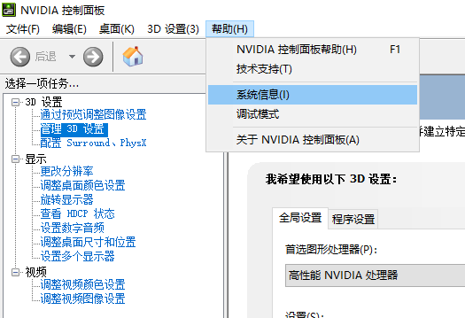

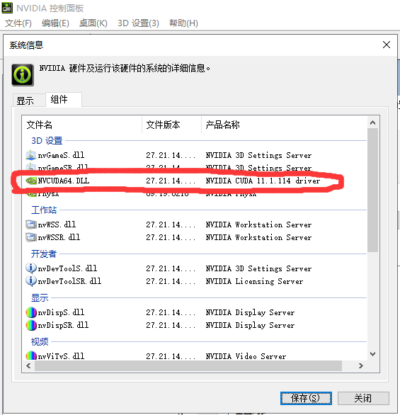

### step2:

打开NVIDIA官网(https://developer.nvidia.com/downloads) - LEARN MORE - 立即下载 - 选择目标电脑的操作系统、位数($$\times 86$$是指32位系统) - 选择exe(local)安装包 - 鼠标左键点击即可下载(cuda_11.1.0_456)。


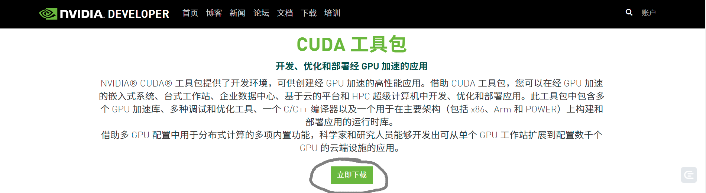

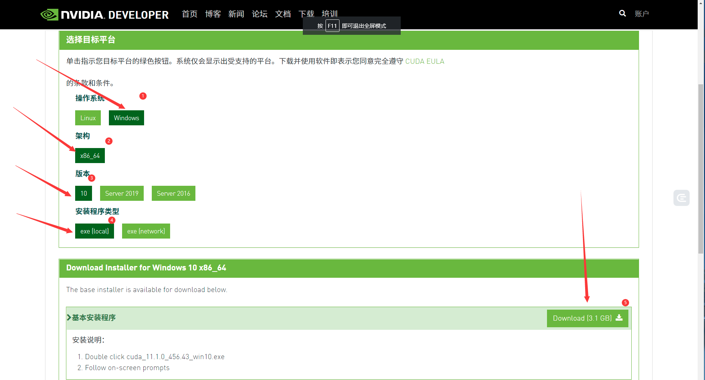

#### 下载历史版本CUDA

找到`CUDA早期版本档案`-点开链接-选择对应的CUDA版本-选择主机环境-下载安装包即可

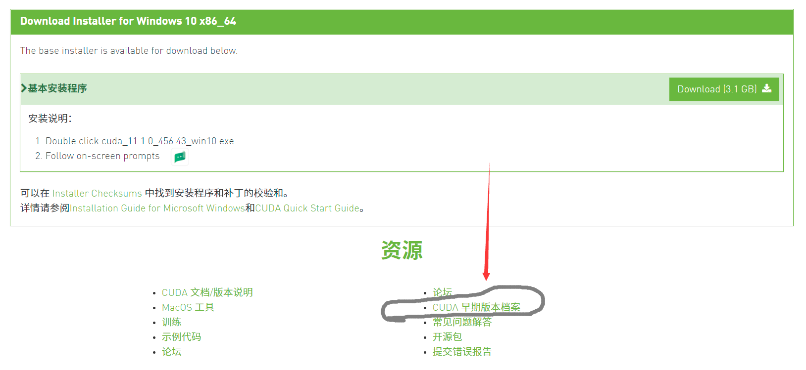


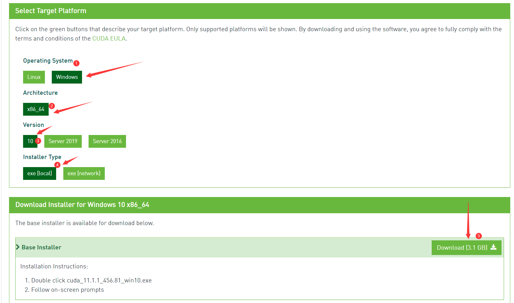

### step3:

#### 安装下载好的CUDA包

##### 无脑安装法

双击打开，一直点下一步/`next`安装完成即可

##### 安装到其他盘

双击打开，选择解压缩的文件路径，选择自定义的安装模式，选择安装路径。点击安装。`这里我安装的时候只有路径自定义了，其他都选择默认，安装完毕后，全选再关闭。没有像网上说的那样需要再手动设置系统变量`

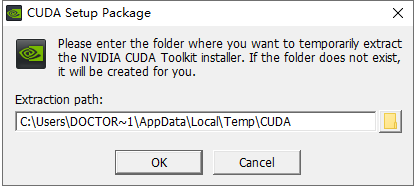

## 安装Pytorch GPU版本

去Pytorch官网查看对应的安装版本

### step1：

打开官网(https://pytorch.org/) - 点击install - 选择对应的环境 - 查看推荐安装的Pytorch综合包。

> 这里选择Stable(1.8.1),Windows,Pip,Python,CUDA 11.1。然后系统给出了安装命令:
>
> ```shell
> pip3 install torch==1.8.1+cu111 torchvision==0.9.1+cu111 torchaudio===0.8.1 -f https://download.pytorch.org/whl/torch_stable.html
> ```

如果可以直接输入这个命令安装，则不必再看下面的。


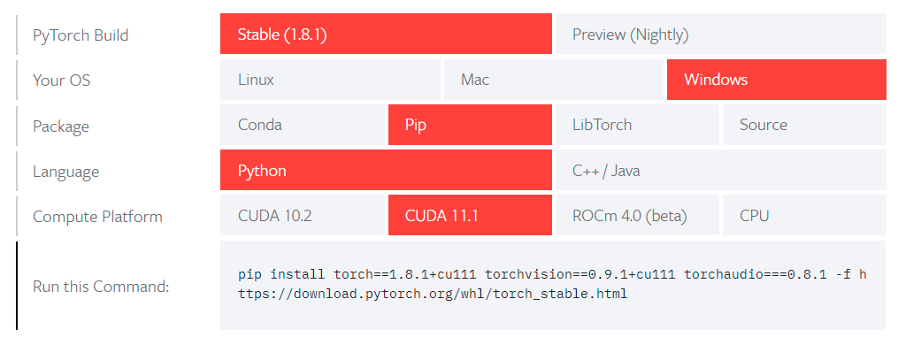

### 安装Pytorch离线包

下载离线包，进行安装。

#### step1:

打开Pytorch本地安装环境包的路径地址(https://download.pytorch.org/whl/torch_stable.html) - 找到`torch==1.8.1+cu111` `torchvision==0.9.1+cu111` `torchaudio===0.8.1`三个包对应的CUDA11.1版本、本机Python版本进行安装。这里cp36、cp37分别代表python3.6、python3.7

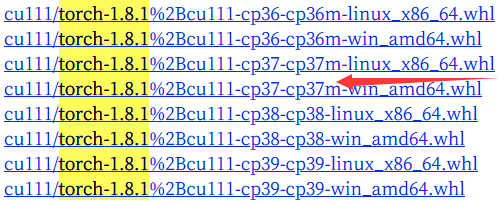

> 1.用迅雷下载会快很多。
>
> 2.用迅雷下载会改变名字。出现乱码。可能需要找到原文件名，进行重命名。这里直接重命名了。

#### step2:

打开cmd，切换到离线包的路径，运行

```shell
pip install 离线包.whl
```

即可安装成功

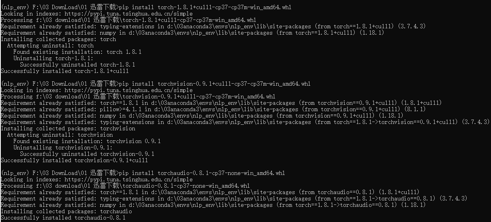

### 使用:将数据、模型、在GPU中使用的函数都导入进GPU的内存中

#### step1:

```python
device = torch.device('cuda' if torch.cuda.is_available() else 'cpu')	# 自动判断CUDA是否可以使用
# 调用方法
.to(device)		# 将数据、模型、在GPU中使用的函数/方法导入到GPU中
# 或者在初始化pytorch张量,令device=device.
torch.zeros((shape), device=device)
```

### 


# GPU运行tensorflow程序步骤

## 安装CUDA&cuDNN版本

`参考GPU运行Pytorch程序中的安装CUDA版本步骤。`——这种方式容易产生别的问题：不能安装tensorflow历史版本。因为CUDA不支持。

使用conda安装cuda&cudnn，是在虚拟环境中安装的。


## 安装GPU版本的tensorflow

step1:

```shell
pip install tensorflow-gpu==2.3.0 -i https://pypi.mirrors.ustc.edu.cn/simple/
```

报错问题：

ERROR: Could not install packages due to an OSError: [WinError 5] 拒绝访问。: 'd:\\03anaconda3\\lib\\site-packages\\numpy\\core\\_multiarray_tests.cp37-win_amd64.pyd'
Consider using the `--user` option or check the permissions.

——解决思路：将spyder、jupyter notebook、anaconda nivation都关闭了再安装一遍。

- 将spyder、jupyter notebook、anaconda nivation都关闭了再安装一遍。成功安装。

### 安装日志：

```shell
(base) C:\Users\Doctor Lee>pip install tensorflow-gpu==2.3.0 -i https://pypi.mirrors.ustc.edu.cn/simple/
Looking in indexes: https://pypi.mirrors.ustc.edu.cn/simple/
Collecting tensorflow-gpu==2.3.0
  Using cached https://mirrors.bfsu.edu.cn/pypi/web/packages/5d/0a/a35e045b095d01340b5495efc4671b82ed00fd582d0633f5251fb1edc0ba/tensorflow_gpu-2.3.0-cp37-cp37m-win_amd64.whl (344.1 MB)
Requirement already satisfied: keras-preprocessing<1.2,>=1.1.1 in d:\03anaconda3\lib\site-packages (from tensorflow-gpu==2.3.0) (1.1.2)
Requirement already satisfied: opt-einsum>=2.3.2 in d:\03anaconda3\lib\site-packages (from tensorflow-gpu==2.3.0) (3.3.0)
Requirement already satisfied: grpcio>=1.8.6 in d:\03anaconda3\lib\site-packages (from tensorflow-gpu==2.3.0) (1.36.1)
Requirement already satisfied: wheel>=0.26 in d:\03anaconda3\lib\site-packages (from tensorflow-gpu==2.3.0) (0.34.2)
Requirement already satisfied: gast==0.3.3 in d:\03anaconda3\lib\site-packages (from tensorflow-gpu==2.3.0) (0.3.3)
Collecting tensorflow-gpu-estimator<2.4.0,>=2.3.0
  Using cached https://mirrors.bfsu.edu.cn/pypi/web/packages/9d/6f/87e922b1dbfa9aa2e79bf150bf05d567eaa4f83bfd329c04834b26b0725e/tensorflow_gpu_estimator-2.3.0-py2.py3-none-any.whl (474 kB)
Requirement already satisfied: google-pasta>=0.1.8 in d:\03anaconda3\lib\site-packages (from tensorflow-gpu==2.3.0) (0.2.0)
Requirement already satisfied: numpy<1.19.0,>=1.16.0 in d:\03anaconda3\lib\site-packages (from tensorflow-gpu==2.3.0) (1.18.1)
Requirement already satisfied: protobuf>=3.9.2 in d:\03anaconda3\lib\site-packages (from tensorflow-gpu==2.3.0) (3.15.6)
Requirement already satisfied: absl-py>=0.7.0 in d:\03anaconda3\lib\site-packages (from tensorflow-gpu==2.3.0) (0.12.0)
Requirement already satisfied: tensorboard<3,>=2.3.0 in d:\03anaconda3\lib\site-packages (from tensorflow-gpu==2.3.0) (2.4.1)
Requirement already satisfied: astunparse==1.6.3 in d:\03anaconda3\lib\site-packages (from tensorflow-gpu==2.3.0) (1.6.3)
Requirement already satisfied: termcolor>=1.1.0 in d:\03anaconda3\lib\site-packages (from tensorflow-gpu==2.3.0) (1.1.0)
Requirement already satisfied: six>=1.12.0 in d:\03anaconda3\lib\site-packages (from tensorflow-gpu==2.3.0) (1.14.0)
Requirement already satisfied: h5py<2.11.0,>=2.10.0 in d:\03anaconda3\lib\site-packages (from tensorflow-gpu==2.3.0) (2.10.0)
Requirement already satisfied: scipy==1.4.1 in d:\03anaconda3\lib\site-packages (from tensorflow-gpu==2.3.0) (1.4.1)
Requirement already satisfied: wrapt>=1.11.1 in d:\03anaconda3\lib\site-packages (from tensorflow-gpu==2.3.0) (1.11.2)
Requirement already satisfied: requests<3,>=2.21.0 in d:\03anaconda3\lib\site-packages (from tensorboard<3,>=2.3.0->tensorflow-gpu==2.3.0) (2.25.1)
Requirement already satisfied: markdown>=2.6.8 in d:\03anaconda3\lib\site-packages (from tensorboard<3,>=2.3.0->tensorflow-gpu==2.3.0) (3.3.4)
Requirement already satisfied: tensorboard-plugin-wit>=1.6.0 in d:\03anaconda3\lib\site-packages (from tensorboard<3,>=2.3.0->tensorflow-gpu==2.3.0) (1.8.0)
Requirement already satisfied: werkzeug>=0.11.15 in d:\03anaconda3\lib\site-packages (from tensorboard<3,>=2.3.0->tensorflow-gpu==2.3.0) (1.0.0)
Requirement already satisfied: google-auth<2,>=1.6.3 in d:\03anaconda3\lib\site-packages (from tensorboard<3,>=2.3.0->tensorflow-gpu==2.3.0) (1.27.1)
Requirement already satisfied: google-auth-oauthlib<0.5,>=0.4.1 in d:\03anaconda3\lib\site-packages (from tensorboard<3,>=2.3.0->tensorflow-gpu==2.3.0) (0.4.3)
Requirement already satisfied: setuptools>=41.0.0 in d:\03anaconda3\lib\site-packages (from tensorboard<3,>=2.3.0->tensorflow-gpu==2.3.0) (45.2.0.post20200210)
Requirement already satisfied: rsa<5,>=3.1.4 in d:\03anaconda3\lib\site-packages (from google-auth<2,>=1.6.3->tensorboard<3,>=2.3.0->tensorflow-gpu==2.3.0) (4.7.2)
Requirement already satisfied: pyasn1-modules>=0.2.1 in d:\03anaconda3\lib\site-packages (from google-auth<2,>=1.6.3->tensorboard<3,>=2.3.0->tensorflow-gpu==2.3.0) (0.2.8)
Requirement already satisfied: cachetools<5.0,>=2.0.0 in d:\03anaconda3\lib\site-packages (from google-auth<2,>=1.6.3->tensorboard<3,>=2.3.0->tensorflow-gpu==2.3.0) (4.2.1)
Requirement already satisfied: requests-oauthlib>=0.7.0 in d:\03anaconda3\lib\site-packages (from google-auth-oauthlib<0.5,>=0.4.1->tensorboard<3,>=2.3.0->tensorflow-gpu==2.3.0) (1.3.0)
Requirement already satisfied: importlib-metadata in d:\03anaconda3\lib\site-packages (from markdown>=2.6.8->tensorboard<3,>=2.3.0->tensorflow-gpu==2.3.0) (3.10.1)
Requirement already satisfied: pyasn1<0.5.0,>=0.4.6 in d:\03anaconda3\lib\site-packages (from pyasn1-modules>=0.2.1->google-auth<2,>=1.6.3->tensorboard<3,>=2.3.0->tensorflow-gpu==2.3.0) (0.4.8)
Requirement already satisfied: urllib3<1.27,>=1.21.1 in d:\03anaconda3\lib\site-packages (from requests<3,>=2.21.0->tensorboard<3,>=2.3.0->tensorflow-gpu==2.3.0) (1.25.8)
Requirement already satisfied: chardet<5,>=3.0.2 in d:\03anaconda3\lib\site-packages (from requests<3,>=2.21.0->tensorboard<3,>=2.3.0->tensorflow-gpu==2.3.0) (3.0.4)
Requirement already satisfied: idna<3,>=2.5 in d:\03anaconda3\lib\site-packages (from requests<3,>=2.21.0->tensorboard<3,>=2.3.0->tensorflow-gpu==2.3.0) (2.8)
Requirement already satisfied: certifi>=2017.4.17 in d:\03anaconda3\lib\site-packages (from requests<3,>=2.21.0->tensorboard<3,>=2.3.0->tensorflow-gpu==2.3.0) (2020.12.5)
Requirement already satisfied: oauthlib>=3.0.0 in d:\03anaconda3\lib\site-packages (from requests-oauthlib>=0.7.0->google-auth-oauthlib<0.5,>=0.4.1->tensorboard<3,>=2.3.0->tensorflow-gpu==2.3.0) (3.1.0)
Requirement already satisfied: zipp>=0.5 in d:\03anaconda3\lib\site-packages (from importlib-metadata->markdown>=2.6.8->tensorboard<3,>=2.3.0->tensorflow-gpu==2.3.0) (2.2.0)
Requirement already satisfied: typing-extensions>=3.6.4 in d:\03anaconda3\lib\site-packages (from importlib-metadata->markdown>=2.6.8->tensorboard<3,>=2.3.0->tensorflow-gpu==2.3.0) (3.7.4.3)
Installing collected packages: tensorflow-gpu-estimator, tensorflow-gpu
Successfully installed tensorflow-gpu-2.3.0 tensorflow-gpu-estimator-2.3.0
```

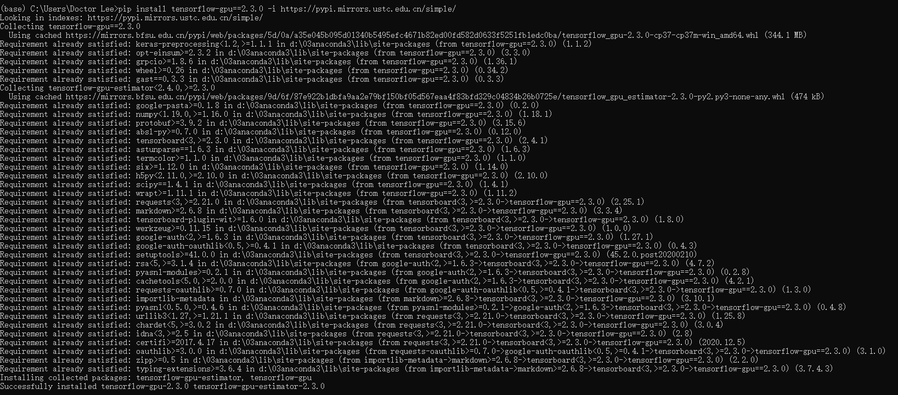

### 安装成功，但是不能使用GPU版本进行运算

shell进入python

执行import tensorflow导入包

报错：

```shell
2021-04-17 20:46:50.300632: W tensorflow/stream_executor/platform/default/dso_loader.cc:59] Could not load dynamic library 'cudart64_101.dll'; dlerror: cudart64_101.dll not found
2021-04-17 20:46:50.303548: I tensorflow/stream_executor/cuda/cudart_stub.cc:29] Ignore above cudart dlerror if you do not have a GPU set up on your machine.
```

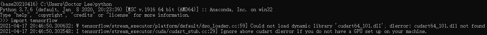

```shell
# 日志文件
(base20210416) C:\Users\Doctor Lee>python
Python 3.7.6 (default, Jan  8 2020, 20:23:39) [MSC v.1916 64 bit (AMD64)] :: Anaconda, Inc. on win32
Type "help", "copyright", "credits" or "license" for more information.
>>> import tensorflow
2021-04-17 20:46:50.300632: W tensorflow/stream_executor/platform/default/dso_loader.cc:59] Could not load dynamic library 'cudart64_101.dll'; dlerror: cudart64_101.dll not found
2021-04-17 20:46:50.303548: I tensorflow/stream_executor/cuda/cudart_stub.cc:29] Ignore above cudart dlerror if you do not have a GPU set up on your machine.
>>> import tensorflow as tf
>>> import tensorflow
>>> tf.ones(5,3)
2021-04-17 20:47:41.376047: I tensorflow/stream_executor/platform/default/dso_loader.cc:48] Successfully opened dynamic library nvcuda.dll
2021-04-17 20:47:41.399160: I tensorflow/core/common_runtime/gpu/gpu_device.cc:1716] Found device 0 with properties:
pciBusID: 0000:01:00.0 name: GeForce GTX 1650 computeCapability: 7.5
coreClock: 1.56GHz coreCount: 16 deviceMemorySize: 4.00GiB deviceMemoryBandwidth: 119.24GiB/s
2021-04-17 20:47:41.406275: W tensorflow/stream_executor/platform/default/dso_loader.cc:59] Could not load dynamic library 'cudart64_101.dll'; dlerror: cudart64_101.dll not found
2021-04-17 20:47:41.410478: W tensorflow/stream_executor/platform/default/dso_loader.cc:59] Could not load dynamic library 'cublas64_10.dll'; dlerror: cublas64_10.dll not found
2021-04-17 20:47:41.416932: I tensorflow/stream_executor/platform/default/dso_loader.cc:48] Successfully opened dynamic library cufft64_10.dll
2021-04-17 20:47:41.422540: I tensorflow/stream_executor/platform/default/dso_loader.cc:48] Successfully opened dynamic library curand64_10.dll
2021-04-17 20:47:41.427022: W tensorflow/stream_executor/platform/default/dso_loader.cc:59] Could not load dynamic library 'cusolver64_10.dll'; dlerror: cusolver64_10.dll not found
2021-04-17 20:47:41.432029: W tensorflow/stream_executor/platform/default/dso_loader.cc:59] Could not load dynamic library 'cusparse64_10.dll'; dlerror: cusparse64_10.dll not found
2021-04-17 20:47:41.435699: W tensorflow/stream_executor/platform/default/dso_loader.cc:59] Could not load dynamic library 'cudnn64_7.dll'; dlerror: cudnn64_7.dll not found
2021-04-17 20:47:41.438774: W tensorflow/core/common_runtime/gpu/gpu_device.cc:1753] Cannot dlopen some GPU libraries. Please make sure the missing libraries mentioned above are installed properly if you would like to use GPU. Follow the guide at https://www.tensorflow.org/install/gpu for how to download and setup the required libraries for your platform.
Skipping registering GPU devices...
2021-04-17 20:47:41.446236: I tensorflow/core/platform/cpu_feature_guard.cc:142] This TensorFlow binary is optimized with oneAPI Deep Neural Network Library (oneDNN)to use the following CPU instructions in performance-critical operations:  AVX2
To enable them in other operations, rebuild TensorFlow with the appropriate compiler flags.
2021-04-17 20:47:41.471520: I tensorflow/compiler/xla/service/service.cc:168] XLA service 0x1c4b4ad5c70 initialized for platform Host (this does not guarantee that XLA will be used). Devices:
2021-04-17 20:47:41.474720: I tensorflow/compiler/xla/service/service.cc:176]   StreamExecutor device (0): Host, Default Version
2021-04-17 20:47:41.477671: I tensorflow/core/common_runtime/gpu/gpu_device.cc:1257] Device interconnect StreamExecutor with strength 1 edge matrix:
2021-04-17 20:47:41.479659: I tensorflow/core/common_runtime/gpu/gpu_device.cc:1263]
<tf.Tensor: shape=(5,), dtype=int32, numpy=array([1, 1, 1, 1, 1])>
>>> tf.ones((5,3))
<tf.Tensor: shape=(5, 3), dtype=float32, numpy=
array([[1., 1., 1.],
       [1., 1., 1.],
       [1., 1., 1.],
       [1., 1., 1.],
       [1., 1., 1.]], dtype=float32)>
>>> import tensorflow
>>> tf.ones((5,3))
<tf.Tensor: shape=(5, 3), dtype=float32, numpy=
array([[1., 1., 1.],
       [1., 1., 1.],
       [1., 1., 1.],
       [1., 1., 1.],
       [1., 1., 1.]], dtype=float32)>
>>> tf.ones((5,3))
<tf.Tensor: shape=(5, 3), dtype=float32, numpy=
array([[1., 1., 1.],
       [1., 1., 1.],
       [1., 1., 1.],
       [1., 1., 1.],
       [1., 1., 1.]], dtype=float32)>
>>> exit()

(base20210416) C:\Users\Doctor Lee>python
Python 3.7.6 (default, Jan  8 2020, 20:23:39) [MSC v.1916 64 bit (AMD64)] :: Anaconda, Inc. on win32
Type "help", "copyright", "credits" or "license" for more information.
>>> import tensorflow as tf
2021-04-17 20:56:25.750131: W tensorflow/stream_executor/platform/default/dso_loader.cc:59] Could not load dynamic library 'cudart64_101.dll'; dlerror: cudart64_101.dll not found
2021-04-17 20:56:25.753883: I tensorflow/stream_executor/cuda/cudart_stub.cc:29] Ignore above cudart dlerror if you do not have a GPU set up on your machine.
>>> tf.ones(5,3)
2021-04-17 20:56:54.630893: I tensorflow/stream_executor/platform/default/dso_loader.cc:48] Successfully opened dynamic library nvcuda.dll
2021-04-17 20:56:54.654560: I tensorflow/core/common_runtime/gpu/gpu_device.cc:1716] Found device 0 with properties:
pciBusID: 0000:01:00.0 name: GeForce GTX 1650 computeCapability: 7.5
coreClock: 1.56GHz coreCount: 16 deviceMemorySize: 4.00GiB deviceMemoryBandwidth: 119.24GiB/s
2021-04-17 20:56:54.661470: W tensorflow/stream_executor/platform/default/dso_loader.cc:59] Could not load dynamic library 'cudart64_101.dll'; dlerror: cudart64_101.dll not found
2021-04-17 20:56:54.665885: W tensorflow/stream_executor/platform/default/dso_loader.cc:59] Could not load dynamic library 'cublas64_10.dll'; dlerror: cublas64_10.dll not found
2021-04-17 20:56:54.671185: I tensorflow/stream_executor/platform/default/dso_loader.cc:48] Successfully opened dynamic library cufft64_10.dll
2021-04-17 20:56:54.676552: I tensorflow/stream_executor/platform/default/dso_loader.cc:48] Successfully opened dynamic library curand64_10.dll
2021-04-17 20:56:54.679325: W tensorflow/stream_executor/platform/default/dso_loader.cc:59] Could not load dynamic library 'cusolver64_10.dll'; dlerror: cusolver64_10.dll not found
2021-04-17 20:56:54.683714: W tensorflow/stream_executor/platform/default/dso_loader.cc:59] Could not load dynamic library 'cusparse64_10.dll'; dlerror: cusparse64_10.dll not found
2021-04-17 20:56:54.687938: W tensorflow/stream_executor/platform/default/dso_loader.cc:59] Could not load dynamic library 'cudnn64_7.dll'; dlerror: cudnn64_7.dll not found
2021-04-17 20:56:54.690257: W tensorflow/core/common_runtime/gpu/gpu_device.cc:1753] Cannot dlopen some GPU libraries. Please make sure the missing libraries mentioned above are installed properly if you would like to use GPU. Follow the guide at https://www.tensorflow.org/install/gpu for how to download and setup the required libraries for your platform.
Skipping registering GPU devices...
2021-04-17 20:56:54.698448: I tensorflow/core/platform/cpu_feature_guard.cc:142] This TensorFlow binary is optimized with oneAPI Deep Neural Network Library (oneDNN)to use the following CPU instructions in performance-critical operations:  AVX2
To enable them in other operations, rebuild TensorFlow with the appropriate compiler flags.
2021-04-17 20:56:54.712935: I tensorflow/compiler/xla/service/service.cc:168] XLA service 0x1887e9514f0 initialized for platform Host (this does not guarantee that XLA will be used). Devices:
2021-04-17 20:56:54.717207: I tensorflow/compiler/xla/service/service.cc:176]   StreamExecutor device (0): Host, Default Version
2021-04-17 20:56:54.720053: I tensorflow/core/common_runtime/gpu/gpu_device.cc:1257] Device interconnect StreamExecutor with strength 1 edge matrix:
2021-04-17 20:56:54.722400: I tensorflow/core/common_runtime/gpu/gpu_device.cc:1263
```

还是不能使用GPU运算。

### 将base环境回滚到原始版本

```shell
# 使用使用conda安装cuda&cudnn后，即可使用tensorflow-gpu 2.3.0版本
conda install cudatoolkit=10.1 cudnn=7.6.5
```

```python
# 测试
import tensorflow as tf
tf.test.is_gpu_available()

mnist = tf.keras.datasets.mnist

(x_train, y_train), (x_test, y_test) = mnist.load_data()

x_train, x_test = x_train / 255.0, x_test / 255.0

model = tf.keras.models.Sequential([
    tf.keras.layers.Flatten(input_shape=(28,28)),
    tf.keras.layers.Dense(512, activation=tf.nn.relu),
    tf.keras.layers.Dropout(0.2),
    tf.keras.layers.Dense(10, activation=tf.nn.softmax)
    ])

model.compile(optimizer='adam', loss='sparse_categorical_crossentropy', metrics=['accuracy'])

model.fit(x_train, y_train, epochs=10)
```


## 查看是否安装成功tensorflow-gpu的命令

```python
activate nlp_env

python 

import tensorflow as tf

tf.test.is_gpu_available()

tf.config.list_physical_devices('GPU')
```

# 在虚拟环境中安装CUDA&CUDNN

——强烈推荐

## 使用conda安装tensorflow2.3.1GPU版本

> 创建一个新的环境，使用conda安装cuda&cudnn。
>
> 使用conda安装cuda&cudnn，是在虚拟环境中安装的

```shell
# 创建一个虚拟环境
conda create -n tensorflow2.3.1 python=3.8
# 安装CUDA cuDNN
conda install cudatoolkit=10.1 cudnn=7.6.5
# 安装tensorflow gpu
pip install tensorflow-gpu==2.3.1 -i https://pypi.mirrors.ustc.edu.cn/simple/
# 安装pytorch GPU版本

```

```python
# 测试
import tensorflow as tf
tf.test.is_gpu_available()

mnist = tf.keras.datasets.mnist

(x_train, y_train), (x_test, y_test) = mnist.load_data()

x_train, x_test = x_train / 255.0, x_test / 255.0

model = tf.keras.models.Sequential([
    tf.keras.layers.Flatten(input_shape=(28,28)),
    tf.keras.layers.Dense(512, activation=tf.nn.relu),
    tf.keras.layers.Dropout(0.2),
    tf.keras.layers.Dense(10, activation=tf.nn.softmax)
    ])

model.compile(optimizer='adam', loss='sparse_categorical_crossentropy', metrics=['accuracy'])

model.fit(x_train, y_train, epochs=10)
```

--