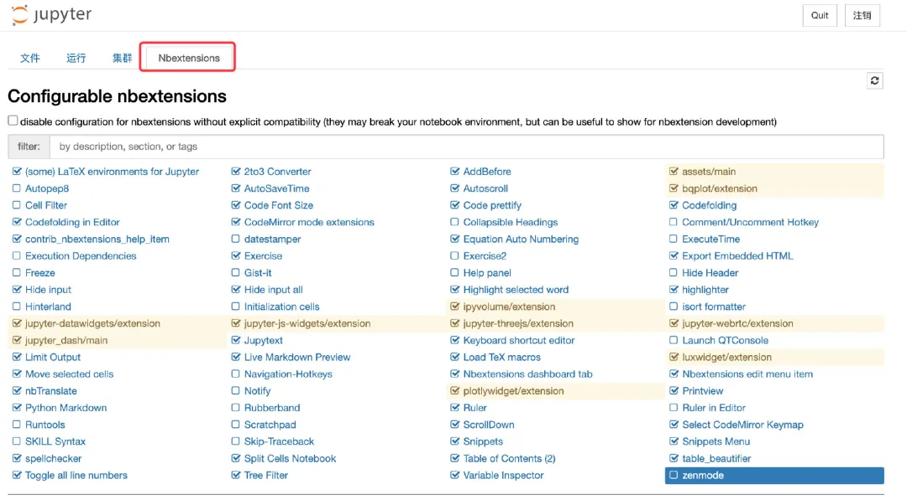
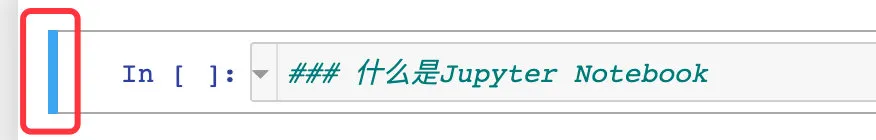
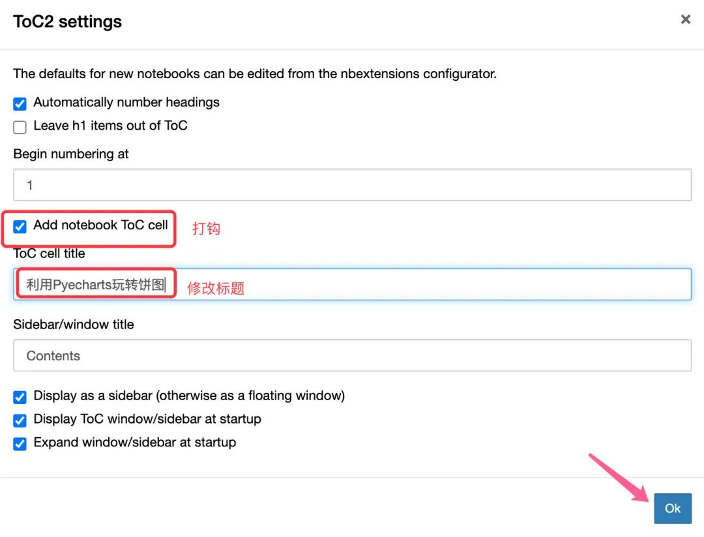

# Jupyter Notebook使用技巧

> https://mp.weixin.qq.com/s/Z2eGtkHyPNKqfh0tW7gx9g

如果你用Python做开发，那么首选 Pycharm；但是如果你想用 Python做数据分析、数据挖掘，以及火热的机器学习和人工智能项目，Jupyter Notebook 注定是首选，因为 Jupyter Notebook 一直都是做数据科学的最佳利器。

**「Python数据之道」** 之前已经分享过一些关于介绍 Jupyter Notebook 的内容：

- [Jupyter 主题更换](https://mp.weixin.qq.com/s?__biz=MzI2NjY5NzI0NA==&mid=2247484957&idx=1&sn=0bcdee53eba6dbd178a0834ff077ca9a&scene=21#wechat_redirect)
- [Jupyter Notebook 输出pdf并支持中文显示](https://mp.weixin.qq.com/s?__biz=MzI2NjY5NzI0NA==&mid=2247484943&idx=1&sn=76cb1838377a95d3ff89c575b650940e&scene=21#wechat_redirect)
- [Jupyter Notebook中自动补全代码](https://mp.weixin.qq.com/s?__biz=MzI2NjY5NzI0NA==&mid=2247485099&idx=1&sn=429b6a5217555b2c162be8d45c14989e&scene=21#wechat_redirect)

即使现在出来了 `Jupyter Lab`，但也是基于 `Jupyter Notebook` 的基础上进行扩展的。本文将介绍继续 `Jupyter Notebook` 的多个使用技巧

.jpg)

## 01 安装和启动Jupyter Notebook

### 安装Jupyter Notebook

笔者自己的 jupyter notebook 是通过 anaconda 自动安装的，非常建议使用 anaconda 来安装包含 Jupyter notebook 在内的各种 Python 工具和包，能够很好地解决各种环境问题。

通过 Anaconda 安装可以参考这篇文章：

- [Anaconda安装](https://mp.weixin.qq.com/s?__biz=MzI2NjY5NzI0NA==&mid=2247484338&idx=1&sn=472e371ed95853e580e73381523037b5&scene=21#wechat_redirect)

### 启动Jupyter notebook

在我们想启动的目录下直接输入如下命令（macOS系统）：

```shell
$ jupyter notebook   # 输入jupyter notebook，立马启动
```

如果是在`Windows`系统下面，我们现在D盘的`/Download`目录下启动：

1、现在搜索栏中输入CMD


2、进入该目录下的命令行中，再输入`jupyter notebook`，便可启动


**安装和启动 Jupyter notebook 的教程可以在网上自行搜索，并不是难题，也不是本文的重点**。

## 02 主题使用

### 安装不同主题

在 jupyter notebook 中安装并使用不同的主题

```shell
# 安装
pip install jupyterthemes
pip install --upgrade jupyterthemes
```

### 切换不同主题

```shell
# 查看所有颜色主题 --list
jt -l

# 选择主题 --theme
jt -t 主题名称

# 恢复默认主题 --recover
jt -r
```

## 03 安装和使用插件

### 安装插件

为了更好的使用 `Jupyter notebook`，我们必须先安装好插件。

```shell
# 安装Jupyter的配置器
pip install jupyter_nbextensions_configurator

# 启动配置器
jupyter nbextensions_configurator enable --user
```

### 使用插件

在安装好插件之后，我们启动 Jupyter Notebook 中，便可以看到安装好的扩展程序：



## 04 使用技巧

### 使用Markdown

在 Jupyter Notebook 中是可以直接使用 Markdown 的：

1、在编辑框中操作：**鼠标箭头放在编辑框左边**



**左边的变成蓝色**，按下快捷键 M（键盘上的），就变成了 Markdown 格式

.jpg)

2、通过工具栏进行设置：

每个 cell 中默认是代码的格式

.jpg)

我们改变 cell 的格式：选择`标记`

.jpg)

### 使用 Latex 公式

既然 Jupyter notebook 能够使用 Markdown ，那么我们可以是 Jupyter Notebook 中编辑 LaTex 公式，举一个例子：在 Markdown 格式下的 cell 中输入如下内容:

```shell
$$ P(A \mid B) = \frac{P(B \mid A) \, P(A)}{P(B)} $$
```

便会生成相应的 LaTeX 公式：

.jpg)

### 快速生成单元格

下图中显示没有第 3 个单元格，我们将光标放在第二个单元格的左边

.jpg)

当编辑栏变成蓝色：按下键盘上的 `A` 键，在上面生成一个新的单元格，如果是按下 `B` 键，则在下面生成一个新的空白单元格：

.jpg)

### 生成侧边栏目录

前面已经提过，在 Jupyter Notebook 中是可以使用 Markdown 的，Markdown 本身又是有目录层级的，所以在 Jupyter Notebook 中也可以使用目录层级。

.jpg)

在上面的案例中，目录层级是从三级开始的：

```shell
### 导入库
### 使用案例
 #### 基础案例
 #### 改变位置和颜色
 #### 图例滚动
 #### 饼图
  ##### 环状饼图
  ##### 多饼图
  ##### 玫瑰图
  ##### 内嵌饼图
```

如果我们的目录层级有更新操作，可以使用这个按钮更新：

.jpg)

如果想改变目录的位置，想移动到右边，可以直接拖动：

将光标放置到这个高度，呈现出十字架，直接向右拖：

.jpg)

改变之后的样子：同时还可以发现右上角有了一个隐藏按钮

.jpg)

当我们设置了目录之后，我们点击任何一个目录层级，便会直接跳到相应的位置。

### 生成文章目录

如果把整个ipynb文件看成是一篇文章，我们还可以生成整个文章的目录：**点击图中按钮**

.jpg)

将 `Add notebookToCcell` 打钩即可，还可以自己拟定标题



生成文章目录的样子，同样的点击某个目录便会相应地发生跳转：

.jpg)

### 高亮显示

如果我们觉得目录中某层级的标题比较重要，自己想高亮显示，可以如下操作：

假设我们想高亮显示`多饼图和内嵌饼图`：

.jpg)

添加高亮之后的效果图：

.jpg)

### 输出多个变量

在 notebook 中默认只会输出最后一个变量的结果，比如下面的例子中变量 a 就没有输出

.jpg)

通过设置 `InteractiveShell.astnodeinteractivity` 参数为 `all`，就可以让所有的变量或者声明都能显示出来，添加两行代码便可实现输出多个变量的效果：

```shell
from IPython.core.interactiveshell import InteractiveShell 

InteractiveShell.ast_node_interactivity = 'all'
```

.jpg)

### 代码序号

有时候在一个单元格中会写太多的代码，我们可以给代码前面设置标号，这样如果有报错能够快速地定位问题：

.jpg)

通过快捷键能够设置序号：

.jpg)

.jpg)


### 拼写检查 Spellchecker

这是检查拼写错误的一个扩展，能够快速的发现我们拼写中的错误。

需要主要的是这个插件是在 Markdown 格式下作用的：

本意表达的是：`This is wrong question`

.jpg)

### 变量检查 Variable Inspector

这是一个检查变量的插件，可以查看变量名、类型、大小、形状和值等。

其中变量的 **shape** (形状)这个参数在进行矩阵运算时，十分实用，并且这个窗口还可以调节大小，排序等功能，十分推荐

### 魔法命令

下面记录的是 IPython 的几个常用的魔法命令：

|  魔法命令  |                             作用                             |
| :--------: | :----------------------------------------------------------: |
|    %pwd    |                      查看当前的工作目录                      |
|    %cd     |                      更改当前的工作目录                      |
|    %ls     |                       查看目录文件列表                       |
| %writefile |                           写入文件                           |
|    %run    | 运行脚本；％run可以从.py文件中执行python代码，也可以指定ipynb文件 |
|   %whos    |                         查看当前变量                         |
|   %reset   |                         清楚当前变量                         |
|  %timeit   |                     测试单行代码运行时间                     |

## 05 Jupyter Notebook两种模式

在 Jupyter Notebook 中有两种模式：

- 命令模式：键盘输入运行程序命令，此时单元格是蓝色的
- 编辑模式：允许你向单元格中输入代码或者文本内容，此时单元格是绿色的

### 命令模式

Esc将带你进入命令模式，你可以使用箭头键在笔记本上导航，命令行模式下的操作：

1. 键盘上的A在当前单元格上方插入一个新单元格，B在下面插入一个新单元格。
2. 键盘上的M将当前单元格更改为Markdown格式，Y将其更改回代码格式
3. D+D：按键两次，删除当前的单元格
4. Shift-Enter : 运行本单元，选中下个单元
5. Ctrl-Enter : 运行本单元
6. Alt-Enter : 运行本单元，在其下插入新单元
7. Shift-K : 扩大选中上方单元
8. Shift-J : 扩大选中下方单元

### 编辑模式

键盘上的 Enter 键会从命令模式转换回给定单元格的编辑模式。

1. `Shift + Tab`：显示刚刚在代码单元中输入的对象的文档字符串（文档）
2. `Ctrl + Shift + -` ：将当前单元格从光标所在的位置分成两部分
3. Esc + F：查找并替换代码，而不是输出
4. Esc + O：切换单元格输出
5. Shift + J或Shift + Down：选择向下的下一个cell
6. Shift + K或Shift + Up：选择向上cell
7. Shift + M：合并多个单元格
8. Ctrl-M : 进入命令模式
9. Shift-Enter : 运行本单元，选中下一单元
10. Ctrl-Enter : 运行本单元
11. Alt-Enter : 运行本单元，在下面插入一单元

## 06 总结

本文从 Jupyter Notebook 的安装开始，简单地介绍了它的安装与启动、不同主题的安装与切换，后续详细介绍了扩展的安装和使用，最后总结了 Jupyter  Notebook 中的两种模式。希望通过本文能够帮助读者快速地掌握 Notebook 的使用，更快上手这个数据分析神器！


# jupyter notebook 更改默认启动路径

### 第一步，

在开始菜单栏找到Anaconda Prompt，并输入下面命令并执行。
jupyter notebook --generate-config

### 第二步，

C:\Users\（这里需要输入你的用户名）.jupyter，在这个文件夹下找到jupyter_notebook_config.py。然后打开这个文件，最好用记事本类型编译器，比如editplus。

### 第三步，

找到这一行代码，把自己所以希望的路径敲进去，如下图所示，


### 第四步，

此时，某些人已经成功了，如果你还没有成功，在win开始菜单中找到jupyter notebook快捷图标，鼠标右键>>更多>>打开文件位置>>目标，然后右击Jupyter Notebook(anaconda)文件，打开属性，删除目标里的"%USERPROFILE%/"，这一行语句。

