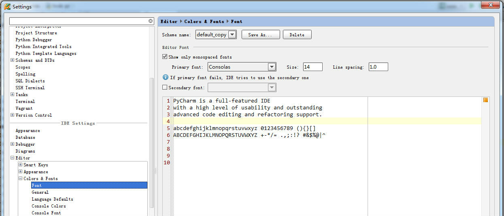

# Pycharm主题设置

### 1.设置IDE皮肤主题

打开File-->setting-->IDE Settings --> Appearance --> Theme --> 选择“Alloy.IDEA Theme”

### 2.设置编辑器“颜色与字体”主题

 File -> Settings -> IDE Settings -> Editor -> Colors & Fonts -> Scheme name -> 选择“Default”

 说明：先选择“Default”，再“Save As”一份，命名为“default_copy”，因为默认的主题是“只读的”，一些字体大小颜色什么的都不能修改，拷贝一份后方可修改！

#### 2.1 修改字体大小

 File -> Settings -> IDE Settings -> Editor -> Colors & Fonts -> Font -> Size -> 设置为“14”

 

### 3.显示“行号”与“空白字符”

 File -> Settings -> IDE Settings -> Editor -> Appearance

 -> 勾选“Show line numbers”、“Show whitespaces”、“Show method separators”

### 4.关闭PEP8.py语言风格提示警告信息

在PyCharm项目设置中找到inspections选项，然后找到PEP 8 coding style violation，在右边的ignore errors，点击下面的加号，添加要忽略的警告信息编码，这个编码可以参考[PEP8.py的官方网站](http://pep8.readthedocs.org/en/latest/intro.html#configuration)，如下图所示我添加了E501(line too long (82 > 79 characters))、E221、E401、E203这几个要忽略的信息。

最近发现一个更为简便的方法，点击要忽略的错误所在，然后按Alt+Enter，在弹出下拉菜单选择ignore errors like this，就可以快速忽略了。

#### 4.1 关闭SQL语句背景颜色

File -> Settings -> Editor -> Colors & Fonts -> General -> Injected language fragment

图片：http://xiangce.baidu.com/picture/detail/29693fb4cedd2e7bf1cc91180bd859e9f24b9b82

4.2 关闭SQL语言特征检测右侧出现的条纹标志

File -> Settings -> Inspections -> SQL -> SQL dialect detection

图片：http://xiangce.baidu.com/picture/detail/ca46add80f05777d7a768e5f7787d95cd9e38dd4

4.3 关闭未使用变量，右侧滚动条旁边的条纹标志

File -> Settings -> Inspections -> JavaScript -> General -> Unused Javascript / ActionScript Local Symbol 

--> Options -->Severity 将Warning改成Weak Warning 然后点击后面"..." --> Edit Settings | Colors & Fonts

--> Error Stripe Mark （前面对勾去掉，所有的Weak Warning 警告都不在显示右边的条纹标志了）

 

### 5.修改IDE快捷键

 File -> Settings -> IDE Settings -> Keymap

 系统自带了好几种快捷键方案，下拉框中有如“default”,“Visual Studio”,在查找Bug时非常有用,“NetBeans 6.5”,“Default for GNOME”等等可选项，

 因为“Eclipse”方案比较大众，个人用的也比较多，最终选择了“Eclipse”。 

 还是有几个常用的快捷键跟Eclipse不一样，为了能修改，还得先对Eclipse方案拷贝一份： 

 (1).代码提示功能，默认是【Ctrl+空格】，现改为跟Eclipse一样，即【Alt+/】

 Main menu -> code -> Completion -> Basic -> 设置为“Alt+/”

 Main menu -> code -> Completion -> SmartType -> 设置为“Alt+Shift+/”

 不过“Alt+/”默认又被 

 Main menu -> code -> Completion -> Basic -> Cyclic Expand Word 占用，先把它删除再说吧（单击右键删除）！

 (2).关闭当前文档，默认是【Ctrl+F4】，现改为跟Eclipse一样，即【Ctrl+W】

 Main menu -> Window -> Active Tool Window -> Close Active Tab -> 设置为 “Ctrl+F4”;

 Main menu -> Window -> Editor -> Close -> 设置为 “Ctrl+W”;

### 6.Git版本控制

File -> Settings -> Version Control -> Git

Path to Git executable:D:\Program Files (x86)\Git\cmd\git.exe