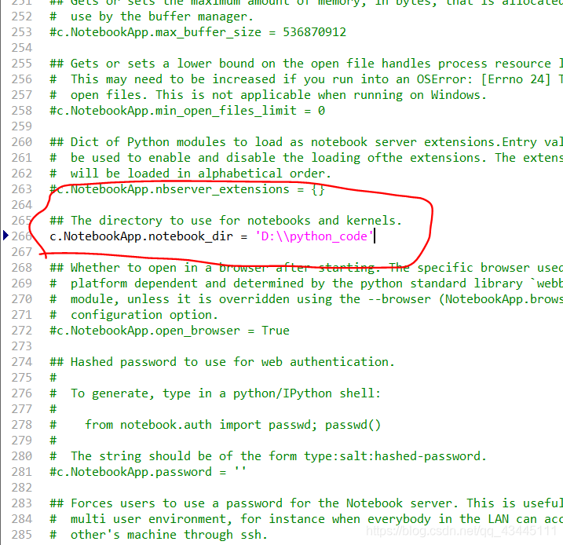
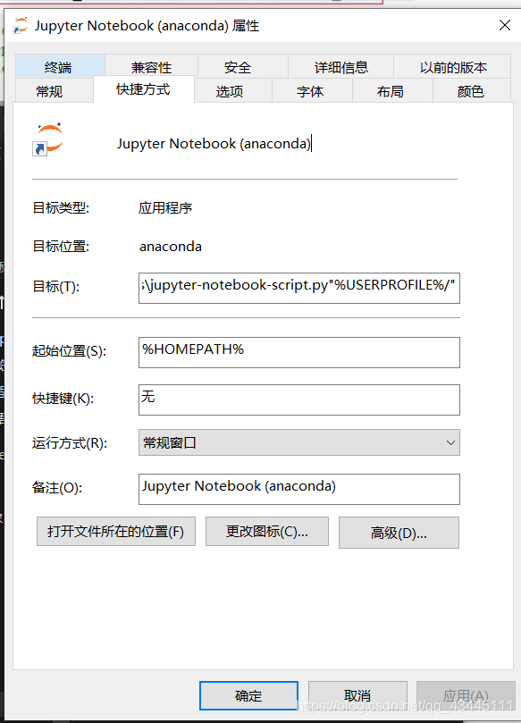

# jupyter notebook 更改默认启动路径

第一步，在开始菜单栏找到Anaconda Prompt，并输入下面命令并执行。

```shell
jupyter notebook --generate-config
```

第二步，C:\Users\（这里需要输入你的用户名）.jupyter，在这个文件夹下找到jupyter_notebook_config.py。然后打开这个文件，最好用记事本类型编译器，比如editplus。

第三步，找到这一行代码，把自己所以希望的路径敲进去，如下图所示，



第四步，此时，某些人已经成功了，如果你还没有成功，在win开始菜单中找到jupyter notebook快捷图标，鼠标右键>>更多>>打开文件位置>>目标，然后右击Jupyter Notebook(anaconda)文件，打开属性，删除目标里的"%USERPROFILE%/"，这一行语句。




