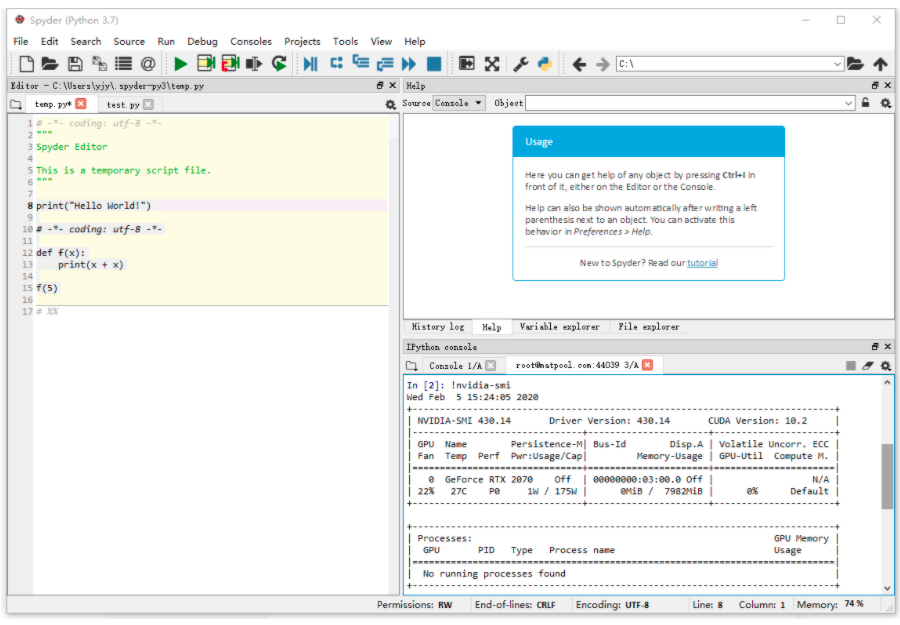

# Spyder连接远程服务器环境步骤

> 案例环境为 64 位 WIN10。


## 快速连接已设置好的服务器

> 初次连接的，请按照step1-step7进行配置。

```shell
# 1.登录服务器
ssh root@47.241.96.131
Ai@2021%com

# 2.打开服务器连接
# python -m spyder_kernels.console
nohup python -m spyder_kernels.console & # 让服务器连接后台运行


# 3.下载json链接文件
/root/.local/share/jupyter/runtime

# 4.使用本地spyder通过下载的json文件连接上服务器

# 5.选中要运行的代码，按F9运行
```


## step1:

获得服务器IP地址、用户名、密码

```
IP地址:47.241.96.131
user:root
password:Ai@2021%com
```

```shell
登录
ssh root@47.241.96.131
Ai@2021%com
```


## step2:

连接上服务器，在命令行输入

```shell
jupyter --runtime-dir
```

该命令用以找到 Kernel 文件的路径。


复制该命令的运行结果，`/root/.local/share/jupyter/runtime`，之后有用。

```shell
/root/.local/share/jupyter/runtime
```


## step3:

输入命令

```shell
pip3 install spyder-kernels
pip3 install -U ipykernel
pip3 install ipython --ignore-installed ipython
python3 -m spyder_kernels.console
```


> 同时保持这个页面不能关闭，否则将断开远程连接。

复制该文件的文件名`kernel-4959.json`。

## step4:

去服务器`/root/.local/share/jupyter/runtime`路径下找到`kernel-4959.json`这个文件，下载到本地。或者复制文件内容后在本地创建一个.json文件也可以。

## step5:

打开本地Spyder，在 Spyder 右下角的 IPython console 中，输入命令

```python
!pip install paramiko
!pip install pyzmq
!pip install ipykernel
```

运行成功后重启 Spyder。

## step6:

在 IPython console 中，右键点击已有 Console 的 Tab，在下拉框中选择 Connect to an existing kernel。也可点击右侧的齿轮按钮，在设置的下拉菜单中找到。(控制台-连接到现有的IPython内核)

在配置页面中，Connection File(连接文件) 选项用以配置 Kernel 文件。点击右侧浏览按钮，找到刚刚保存的 `kernel.json` 文件。

将 This is a remote kernel 前面的复选框选中。填写信息如下：

```
Host（主机名）：IP地址
Port（端口）: 默认22
User（用户名）：root。
Password（密码）：您租用机器时填写的密码。
SSH Keyfile 可不填。
```


如果您使用的是 Spyder 旧版本，填写信息会有些许不同：

```
Host Name：{用户名}@{主机名}:{您的端口号}。例如：root@hz.matpool.com:44039.
Password：您租用矩池云机器时，填写的密码。
SSH Keyfile 可不填。
```


点击 OK 开始连接。

当出现 `root@hz.matpool.com` 开头的 Kernel 时，意味着连接成功。


## step7:运行代码

需要选中将要运行的代码，然后按F9或者点击`运行-运行选定的代码或当前行`。


## else:

### 查看系统信息

在 IPython console里手动输入 Python 命令，或输入 `!+Bash` 命令，例如 `!nvidia-smi` 以查看显卡信息。



### 查看下载文件的地址

相对路径/默认下载地址:

```python
/root/.keras/datasets/
```


指定下载地址需要给出绝对路径。

### Spyder 暂不支持文件同步功能

