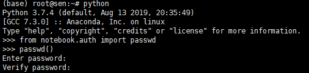
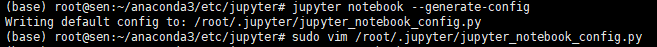
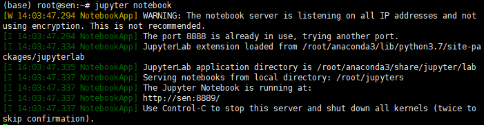
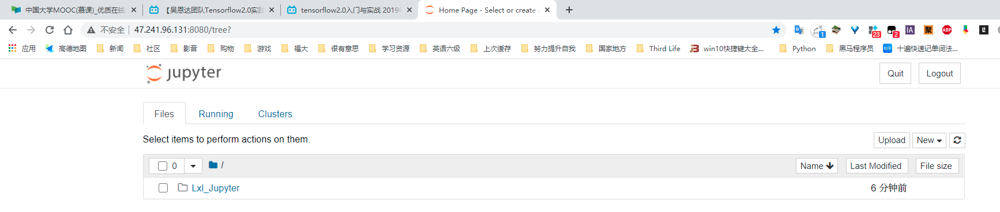

# 设置jupyter连接远程服务器

## 快速连接已设置好的服务器

> 初次连接的，请按照step1-step7进行配置。

```shell
# 1.登录服务器
ssh root@47.241.96.131
Ai@2021%com

# 2.打开服务器连接
# jupyter notebook
nohup jupyter notebook & # 让服务器连接后台运行
# 3945

# 3.浏览器中输入服务器IP地址&端口号，再输入密码进入jupyter页面
47.241.96.131:8080
```


## step1:

获得服务器IP地址、用户名、密码。登录服务器窗口

```shell
IP地址:47.241.96.131
user:root
password:Ai@2021%com
```

## step2:

服务器配置JUYPTER：

在终端中以下代码运行：

```python
python3
from notebook.auth import passwd
passwd()
exit()
```



记住输出的字符串，然后通过`exit()`退出`ipython`环境。

## step3:

进入到安装目录：`CD /ROOT/ANACONDA3/ETC/JUPYTER（安装路径）` 执行

```python
jupyter notebook --generate-config
```

然后会在`anaconda`的安装目录下的.jupyter目录下产生一个`jupyter_notebook_config.py`文件 （我这是在/root/.jupyter/下 ）



## step4:

执行`which jupyter_notebook_config.py`找到`jupyter_notebook_config.py`这个文件的路径。

在这个路径下打开文件修改。

或者将文件下载到本地，修改后覆盖原文件。

## step5:

修改配置信息，在`JUPYTER_NOTEBOOK_CONFIG.PY`最后加上以下代码：

```python
argon2:$argon2id$v=19$m=10240,t=10,p=8$LdnyZtGqmLsGnsFkKg7Ffw$YXZOM+X6BArcNzh6Zpd1VQ
```


```python
c.NotebookApp.ip = '*'  # 允许访问此服务器的 IP，星号表示任意 IP
c.NotebookApp.password = u'sha1:932bd67399b4:6619368c27d512f75ae768730ad59f8cd6546667' # 之前生成的密码 hash 字串
c.NotebookApp.password = u'argon2:$argon2id$v=19$m=10240,t=10,p=8$kdPJsZa9jk8xrV9iuED6+w$l4/Jx5jTcCop6xk8EBWRxw' # 之前生成的密码 hash 字串

c.NotebookApp.open_browser = False # 运行时不打开本机浏览器
c.NotebookApp.port = 8888 # 使用的端口
c.NotebookApp.enable_mathjax = True # 启用 MathJax
c.NotebookApp.notebook_dir = '/root/jupyter'      # 服务器上存放jupyter代码文件的路径
c.NotebookApp.allow_remote_access = True     # 允许远程访问
c.NotebookApp.allow_root = True     # 允许以root身份启动
```

修改完毕后覆盖服务器上的源文件。

## step6:

启动服务

```python
jupyter notebook
```

启动后，效果如图所示：



## step7:

在本地主机浏览器中输入`远程服务器IP地址:开放端口号`，再输入登录密码。即可进入。




