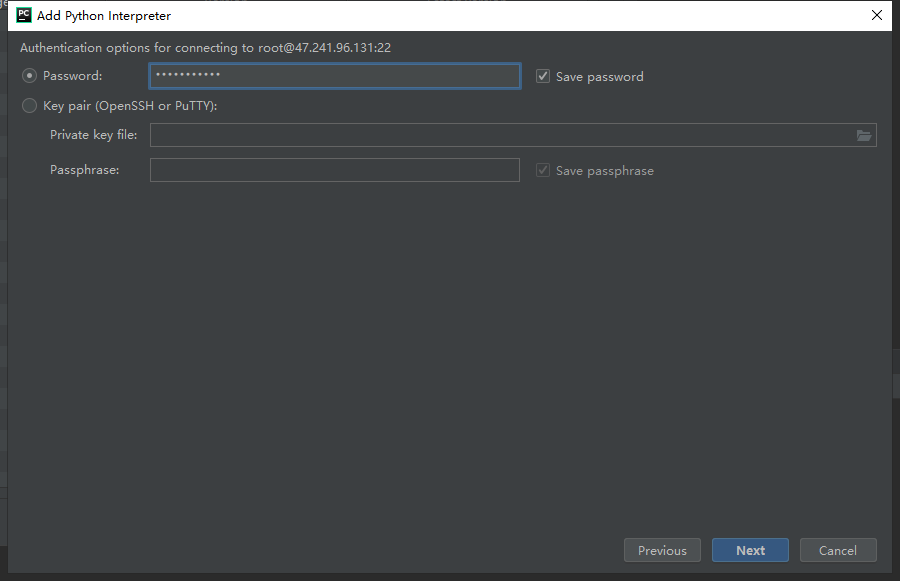

# 使用pycharm专业版配置连接远程服务器环境步骤

## step1:

获得服务器IP地址、用户名、密码

```
IP地址:47.241.96.131
user:root
password:Ai@2021%com
```

## step2:

打开Pycharm专业版-->Tools-->Deployment-->Configuration-->


Connection-->输入host(IP地址)、User name(用户名)、Port(默认22)、Password(密码)、Root path(本地文件上传至服务器的路径)


Mappings(设置本地文件的地址，一般默认选择):


## step3:

设置使用服务器的环境

打开Pycharm专业版-->Tools-->Deployment-->Options-->


Always:修改了就同步上传修改服务器端;

On explicit save action (Ctrl+S):保存再上传修改服务器端;

Never:从不上传修改服务器端;


## step4:

设置环境为服务器环境

File-->Setting-->Project: untitled-->Project Interpreter-->环境添加(add)--> Host(服务器IP地址)、Username(用户名)


Password(密码)



Interpreter(服务器环境路径)--Finish(完成)

